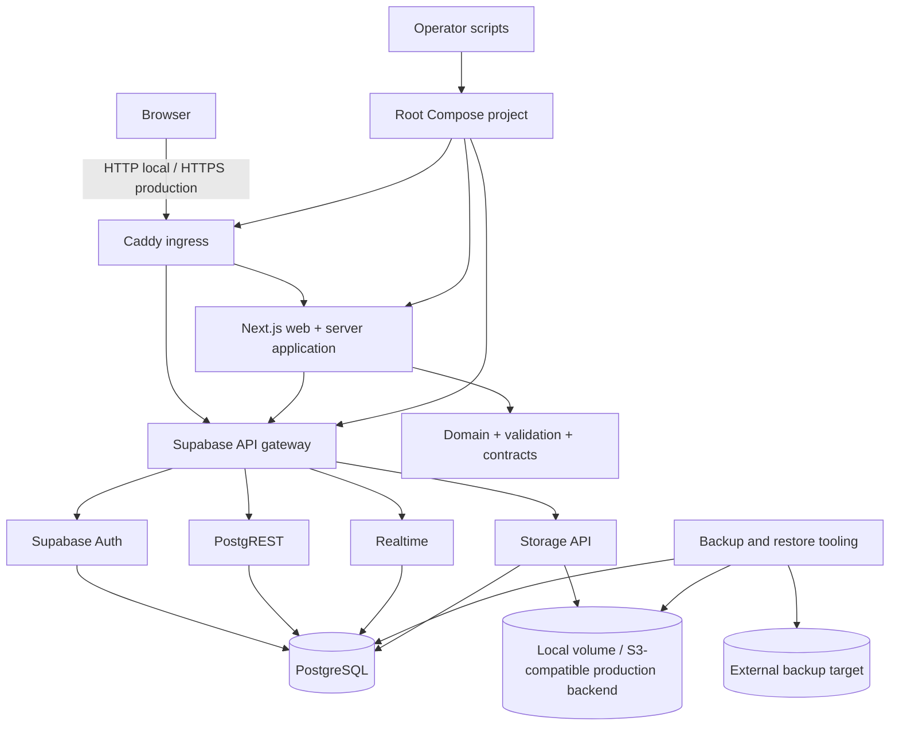

# Web and Supabase Foundation Design

**Spec**: `.specs/features/001-web-supabase-foundation/spec.md`
**Status**: Approved on 2026-09-14

---

## Architecture Overview

CampusMarkt uses an npm-workspaces TypeScript monorepo. One production Next.js process serves the responsive UI, route handlers, and server-side application layer. Framework-independent domain and validation packages remain importable by a future mobile client.

The repository vendors the official Supabase self-hosted Docker release at `self-hosted/v0.8.1`. CampusMarkt does not flatten or rewrite the upstream multi-service configuration. A root Compose configuration includes the pinned upstream file and adds the web application, Caddy ingress, private networks, health dependencies, and environment mapping through CampusMarkt-owned overrides.



The local and production shapes use the same services but different configuration:

| Concern | Local | Production contract |
| --- | --- | --- |
| Ingress | Caddy on loopback HTTP | Caddy on ports 80/443 with valid TLS |
| Application | Containerized production build | Same immutable application image |
| Database | Named persistent volume | Durable volume plus off-host backup |
| Storage | Named persistent volume | S3-compatible backend plus backup |
| Auth email | Development mail capture or disabled external delivery | External SMTP required |
| Secrets | Generated local `.env`, ignored | Operator-managed secrets, never committed |
| Readiness | Container health and smoke checks | Health, configuration, migration, and smoke checks |

---

## Code Reuse Analysis

### Existing Components to Leverage

| Component | Location | How to Use |
| --- | --- | --- |
| Product source of truth | `docs/product/` | Constrains the shell wording, localization readiness, privacy, and future feature boundaries. |
| Project engineering rules | `AGENTS.md` | Supplies architecture, security, testing, commit, and terminal lifecycle requirements. |
| Architecture decisions | `.specs/STATE.md` | AD-001 through AD-006 constrain repository, product, application, and infrastructure choices. |
| Official Supabase self-hosted release | `infra/supabase/` after vendoring | Preserve its Compose services, scripts, gateway configuration, and upgrade metadata at tag `self-hosted/v0.8.1`. |

No existing application source or test pattern can be reused because this is the first code feature.

### Integration Points

| System | Integration Method |
| --- | --- |
| Next.js to Supabase | Server and browser clients receive distinct environment contracts; only the publishable key is browser-visible. |
| Caddy to Next.js | Private Docker-network HTTP upstream with a health endpoint. |
| Caddy to Supabase | Private Docker-network upstream to the official API gateway. |
| Migrations to PostgreSQL | Versioned SQL under `supabase/migrations/`, applied once by a dedicated migration command/job. |
| Storage | Local persistent backend by default; environment-selected S3-compatible backend for production. |
| Operations | Cross-platform Node scripts validate configuration; Docker-contained tools perform database and Storage backup/restore. |

---

## Repository Layout

```text
apps/
  web/
    src/app/                 Next.js routes and presentation
    src/modules/             server-side feature application modules
    src/infrastructure/      framework/provider adapters
    tests/                   web integration and browser tests
packages/
  domain/                    framework-independent domain rules
  validation/                shared schemas and input contracts
  api-client/                client-facing application contracts
  types/                     shared transport types when justified
infra/
  caddy/                     ingress configuration
  supabase/                  pinned official self-hosted distribution
  compose/                   CampusMarkt overrides and profiles
scripts/
  config/                    environment and production-readiness checks
  operations/                stack, migration, backup, restore, and smoke tooling
supabase/
  migrations/                application-owned SQL history
  tests/                     database and RLS verification
compose.yaml                 root orchestration entry point
package.json                 npm workspace and root quality commands
```

Directories are created only by tasks that populate them. Empty speculative packages are not allowed; each initial package contains a small public contract and boundary test.

---

## Components

### Workspace and quality contract

- **Purpose**: Provide one lockfile and root commands for build, type checking, lint, formatting, unit, integration, browser, architecture, and security gates.
- **Location**: `package.json`, workspace package manifests, and root tool configuration.
- **Interfaces**:
  - `npm run check` - deterministic non-container code gate.
  - `npm run test:integration` - tests requiring the local stack.
  - `npm run test:e2e` - responsive browser smoke tests.
  - `npm run verify` - complete foundation gate.
- **Dependencies**: Node.js 24 LTS, npm workspaces, TypeScript, ESLint, Prettier, Vitest, Playwright.
- **Reuses**: `AGENTS.md` quality and security rules.

### Next.js application

- **Purpose**: Serve the responsive CampusMarkt shell, a liveness endpoint, and a dependency-aware readiness endpoint.
- **Location**: `apps/web/`.
- **Interfaces**:
  - `GET /` - minimal German/English-ready product shell.
  - `GET /health/live` - process liveness without external dependency checks.
  - `GET /health/ready` - reports ready only when required application dependencies respond.
- **Dependencies**: Next.js App Router, React, application configuration adapter, Supabase client adapter.
- **Reuses**: Product positioning in `docs/product/00-product-vision.md`.

### Boundary packages

- **Purpose**: Make domain, validation, API contract, presentation, application, and infrastructure dependency directions executable rather than documentary.
- **Location**: `packages/domain/`, `packages/validation/`, `packages/api-client/`, `packages/types/`, and ESLint boundary configuration.
- **Interfaces**:
  - Each package exposes only its public `index.ts` contract.
  - Presentation may depend on public application/contracts; domain cannot depend on Next.js, Supabase, or presentation.
- **Dependencies**: TypeScript project references or workspace resolution plus ESLint boundary rules.
- **Reuses**: AD-003 and the target architecture in `README.md`.

### Environment validator

- **Purpose**: Validate local, container, and production contracts before startup or readiness is declared.
- **Location**: `scripts/config/`.
- **Interfaces**:
  - `validate-env --mode local|production` returns zero only for a complete mode-specific contract.
  - `preflight --mode production` validates Docker, Compose, CPU, memory, disk, TLS, SMTP, Storage, and backup configuration.
- **Dependencies**: Node.js standard library and shared validation schemas; no operational secrets are printed.
- **Reuses**: The required/optional variables from the pinned Supabase `.env.example`.

### Root Compose project

- **Purpose**: Start and stop the complete stack through one project entry point.
- **Location**: `compose.yaml` and `infra/compose/`.
- **Interfaces**:
  - `docker compose up -d --wait` starts the complete healthy local stack.
  - `docker compose down` stops it without deleting persistent data.
  - Explicit profiles enable production-only configuration without exposing internal ports.
- **Dependencies**: Pinned Supabase Compose, application image, Caddy, generated environment.
- **Reuses**: Upstream health checks and services rather than recreating them.

### Supabase application baseline

- **Purpose**: Establish application migration history, a private-by-default example application table, Data API grants, and RLS verification conventions.
- **Location**: `supabase/migrations/` and `supabase/tests/`.
- **Interfaces**:
  - Migration runner applies pending application migrations once and exits.
  - Database tests assert RLS enabled and access denied for roles without policies.
  - Database advisory gate reports security and performance findings.
- **Dependencies**: PostgreSQL in the pinned Supabase stack and project-scoped Supabase CLI where supported.
- **Reuses**: Official roles and Data API conventions.

### Ingress configuration

- **Purpose**: Provide the only public network boundary and route app and API traffic.
- **Location**: `infra/caddy/`.
- **Interfaces**:
  - Local host routes use loopback HTTP.
  - Production routes terminate valid HTTPS and proxy only documented web and Supabase gateway paths.
- **Dependencies**: Caddy container and Docker DNS.
- **Reuses**: Upstream Supabase gateway rather than exposing individual APIs.

### Backup and restore tooling

- **Purpose**: Export PostgreSQL and Storage data outside primary volumes and prove isolated restoration.
- **Location**: `scripts/operations/`.
- **Interfaces**:
  - `backup --destination <path>` creates timestamped database and Storage artifacts plus a manifest and returns non-zero on partial failure.
  - `restore --source <manifest> --target isolated` refuses the active production target and verifies restored fixture checksums.
- **Dependencies**: Docker Compose, `pg_dump`/`pg_restore` from the database image, archive/checksum tools, Storage backend adapter.
- **Reuses**: Official Supabase backup and self-hosted service layout where applicable.

### Secret scanner and smoke checks

- **Purpose**: Prevent committed credentials and prove public behavior after startup.
- **Location**: Root scripts and CI configuration.
- **Interfaces**:
  - Secret scan examines tracked files and fails on configured secret patterns.
  - Smoke checks verify the web shell, liveness, readiness, and Supabase gateway endpoints.
- **Dependencies**: Git tracked-file inventory, Node.js, running Compose stack for smoke checks.
- **Reuses**: Environment allowlist so safe placeholders do not trigger false positives.

---

## Data Models

No marketplace data model is introduced. The foundation migration creates one non-product canary table only to verify migration history and private-by-default RLS behavior.

### Foundation Canary

```sql
foundation_canary (
  id uuid primary key,
  marker text not null,
  created_at timestamptz not null default now()
)
```

- RLS is enabled.
- No `anon` or `authenticated` policy is created.
- Direct fixture manipulation is limited to migration/administrative test tooling.
- The table is removed only through a later explicit migration if it no longer provides operational value.

### Backup Manifest

```typescript
interface BackupManifest {
  formatVersion: 1
  createdAt: string
  supabaseRelease: string
  databaseArtifact: { path: string; sha256: string }
  storageArtifact: { path: string; sha256: string }
}
```

The manifest contains no credentials or private data values.

---

## Error Handling Strategy

| Error Scenario | Handling | User or operator impact |
| --- | --- | --- |
| Missing required environment value | Validator returns non-zero and lists variable names only | Stack is not reported healthy. |
| Required container unhealthy | Compose wait and smoke gate fail with service identity | Operator receives a bounded diagnostic instead of false readiness. |
| Supabase dependency unavailable | `/health/live` remains healthy but `/health/ready` returns 503 | Orchestrator distinguishes process health from dependency readiness. |
| Migration failure | Dedicated job exits non-zero and blocks readiness/deploy completion | No partially reported deployment. |
| Secret detected in tracked content | Quality gate exits non-zero with file and rule, redacting the value | Commit/deploy is blocked. |
| Backup database or Storage step fails | No success manifest is emitted; command exits non-zero | Partial artifacts cannot be mistaken for a valid recovery point. |
| Restore targets active environment | Restore refuses execution | Production data is protected from accidental overwrite. |
| Host below capacity floor | Production preflight names the failed resource | Production startup is classified unsafe. |

---

## Security Boundaries

- Only Caddy binds public HTTP/HTTPS ports in the production profile.
- PostgreSQL, Supavisor, Studio, Auth, REST, Realtime, Storage, and internal gateway ports remain on private Docker networks.
- Studio is not exposed publicly by default. Operator access requires an explicit protected route or SSH tunnel outside this feature.
- Browser bundles receive only the public Supabase URL and publishable key.
- Secret/server keys, database credentials, SMTP credentials, TLS private keys, and Storage credentials never use `NEXT_PUBLIC_` variables.
- Every application table in an exposed schema enables RLS. Grants and RLS policies are separate explicit decisions.
- Views use invoker semantics when later features introduce them.
- Privileged database functions are placed outside exposed schemas, revoke public execution, and authenticate callers when later features require them.
- Production secrets are injected by the operator; `.env.example` contains names and inert placeholders only.

---

## Verification Strategy

| Layer | Verification |
| --- | --- |
| TypeScript packages and application | Type check, lint, formatting check, Vitest unit and architecture tests, production build. |
| Environment contract | Table-driven unit tests for every required variable and redaction behavior. |
| Compose structure | `docker compose config` plus assertions for public ports, networks, volumes, profiles, health checks, and immutable image tags. |
| Running stack | Health wait, endpoint smoke tests, migration history query, RLS role tests, restart persistence test. |
| Responsive shell | Playwright at 360px and 1280px asserting no document overflow. |
| Secrets | Tracked-file scanner plus a discrimination fixture containing a fake forbidden secret. |
| Backup/restore | Database row and Storage object round-trip into an isolated Compose project with checksum comparison. |

The discrimination sensor runs in a scratch worktree or copied files and must prove that boundary, readiness, RLS, secret, and backup tests fail when their protected behaviors are mutated.

---

## Risks & Concerns

| Concern | Location | Impact | Mitigation |
| --- | --- | --- | --- |
| The repository has no application or tests yet. | `README.md:15` | Tooling and coverage conventions have no existing implementation precedent. | Use the spec's complete AC/edge-case coverage as the minimum and encode root commands immediately. |
| Self-hosted Supabase is a moving multi-service distribution. | `.specs/STATE.md:54` | Custom edits can make updates fragile or incompatible. | Vendor `self-hosted/v0.8.1`, record it, keep CampusMarkt changes in overrides, and test `docker compose config`. |
| The developer workstation currently runs Node.js 22 while Node.js 24 is the current LTS. | Runtime inspection on 2026-09-14 | Host-only commands can differ from the production image. | Pin Node.js 24 in `.nvmrc`, `engines`, and Docker; allow development through the container until the host is upgraded. |
| Full Supabase plus browser and restore tests are resource-heavy. | Foundation scope | CI and local gates can become slow or flaky. | Separate quick, full, and operational gates; keep required services health-gated and diagnostics bounded. |
| Docker volumes can be mistaken for backups. | `.specs/features/001-web-supabase-foundation/spec.md:40` | A VPS failure could destroy database and media together. | Require off-volume artifacts and prove isolated restore before production-ready classification. |
| Self-hosted production lacks managed backups and platform support. | `.specs/STATE.md:56` | Recovery and upgrades depend on project discipline. | Pin releases, document upgrades, require backup-before-upgrade, and automate smoke/restoration checks. |

---

## Tech Decisions

| Decision | Choice | Rationale |
| --- | --- | --- |
| Runtime | Node.js 24 LTS | Current production LTS on the design date; Node.js recommends production use of LTS releases. |
| Package/workspace manager | npm workspaces | Ships with Node, supports the required monorepo, and avoids another bootstrap dependency. |
| Web framework | Next.js 16 App Router with React 19 | Current stable documented line and complete Node/Docker deployment support. Exact patches are lockfile-pinned during scaffolding. |
| Supabase distribution | Official `self-hosted/v0.8.1` snapshot | Current official tagged snapshot on the design date, tested upstream as a compatible set. |
| Supabase integration | Vendored upstream files plus CampusMarkt overrides | Preserves upstream updateability while delivering one root Compose operation. |
| Reverse proxy | Caddy 2, immutable image digest recorded during implementation | Minimal automatic HTTPS configuration and an explicit single ingress boundary. |
| Tests | Vitest for units/architecture, Playwright for browser behavior, Node scripts plus SQL for infrastructure integration | Covers TypeScript, browser, Compose, database, and operations without adding a second general-purpose language. |
| Boundary enforcement | ESLint import restrictions plus negative architecture tests | Gives fast feedback and proves forbidden imports are actually rejected. |
| Local/production variance | Compose overrides/profiles and mode-specific validated environments | Keeps service topology aligned while preventing production requirements from blocking local work. |
| Schema workflow | Imperative, versioned SQL migrations | Fits ordered product evolution and leaves an auditable application-owned history. |

---

## Requirement Mapping

| Requirement | Design coverage |
| --- | --- |
| FOUND-01 | Root Compose project, ingress, environment validator, health endpoints, smoke and persistence verification. |
| FOUND-02 | npm workspaces, Next.js application, boundary packages, lint/architecture tests, Playwright viewport checks. |
| FOUND-03 | Application migrations, RLS baseline, role tests, environment separation, secret scanner, database checks. |
| FOUND-04 | Production profiles, HTTPS contract, preflight, pinned upgrades, backup manifest, isolated restore drill. |
