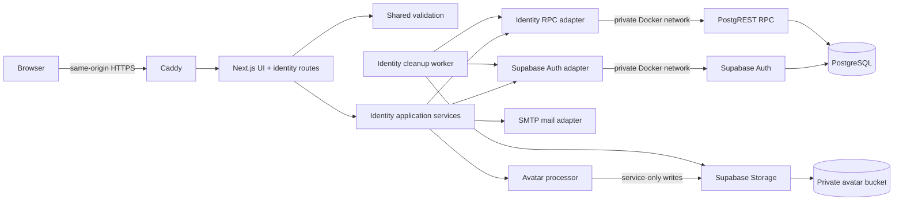
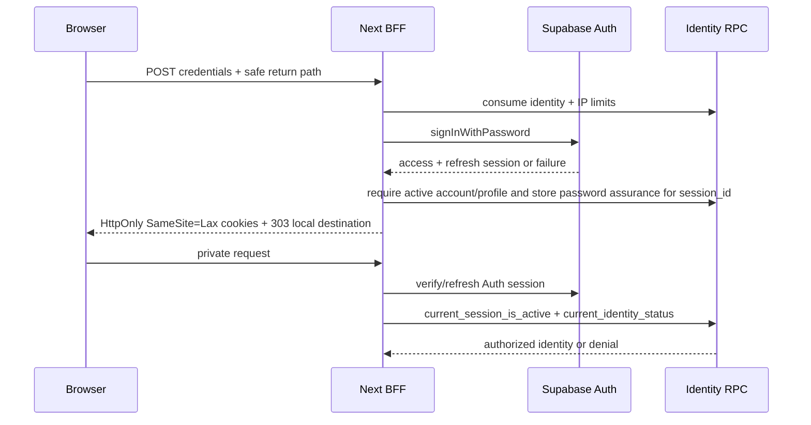
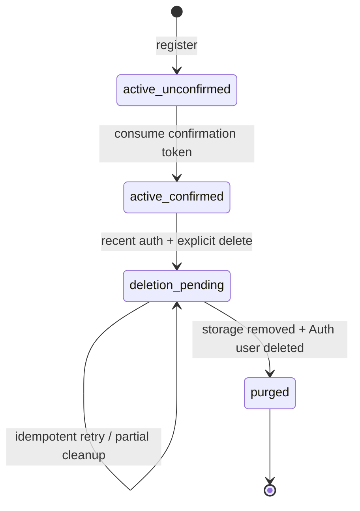

# Identity and Accounts Design

**Spec**: `.specs/features/002-identity-accounts/spec.md`
**Status**: Approved on 2026-09-15

---

## Architecture Overview

Identity is implemented inside the existing TypeScript modular monolith as a server-owned Backend-for-Frontend (BFF). Browsers submit identity operations to same-origin Next.js Route Handlers; they do not call Supabase Auth mutation endpoints directly. Route Handlers validate transport concerns and delegate to transport-neutral application services. Supabase Auth remains the source of truth for credentials, Auth identities, and refresh sessions, while application-owned PostgreSQL tables hold the safe public identity, consent, abuse-control, lifecycle, and audit state.

This conforms to AD-002, AD-003, and AD-006. It adds AD-007 as the project-wide rule that browser identity mutations cross the Next.js BFF and that authorization rules stay outside page and route components.



### Selected approach and rejected alternatives

| Approach | Decision | Reason |
| --- | --- | --- |
| Next.js BFF over Supabase Auth | **Selected** | Centralizes HttpOnly cookies, exact rate limits, enumeration-safe responses, audit, avatar processing, deletion, and origin checks while retaining Supabase credentials and sessions. |
| Browser calls Supabase Auth directly with an SSR hybrid | Rejected | Public Auth mutation endpoints could bypass CampusMarkt's per-identity/IP limits and audit contract; browser-managed clients also weaken the strict server-owned cookie boundary. |
| CampusMarkt implements passwords and sessions itself | Rejected | Reimplements credential storage, refresh rotation, and Auth lifecycle without a product requirement that justifies that security burden. |

### External research findings

- Supabase's server-side Auth guidance uses cookie-backed clients and PKCE-compatible flows. The identity integration uses a server-only client and a cookie adapter; no Auth token is stored in `localStorage`: <https://supabase.com/docs/guides/auth/server-side>.
- Supabase sessions are refresh-token-backed and access JWTs remain valid until their expiry even after sign-out. Therefore every CampusMarkt private request additionally verifies that the JWT `session_id` still exists in `auth.sessions`: <https://supabase.com/docs/guides/auth/sessions> and <https://supabase.com/docs/guides/auth/signout>.
- Self-hosted Auth supports an absolute session timebox through `GOTRUE_SESSIONS_TIMEBOX`; CampusMarkt sets it to 30 days and keeps the one-hour access JWT lifetime: <https://github.com/supabase/supabase/blob/master/docker/CONFIG.md>.
- GoTrue exposes one `GOTRUE_MAILER_OTP_EXP` value for email OTP/link expiry. Because the approved specification requires 24 hours for confirmation and 30 minutes for recovery, CampusMarkt issues purpose-bound application action tokens and uses the Supabase Admin API only for the resulting confirmation or password change.
- Supabase Storage authorization is based on RLS, and service credentials bypass RLS. The avatar bucket remains private, browser writes are disabled, and all privileged calls remain server-only: <https://supabase.com/docs/guides/storage/security/access-control>.
- Next.js treats Route Handlers and Server Actions as reachable mutation endpoints. Identity authorization is repeated in the data-access/application boundary rather than relying on route layout or proxy checks.

### Trust boundaries

1. **Public browser boundary**: accepts bounded form/JSON/multipart input, a Caddy-derived client IP, and same-origin cookies. Every state-changing request requires an allowed `Origin` matching the configured canonical origin and rejects cross-origin or absent browser mutation context unless an explicitly tested non-browser adapter is added later.
2. **Web server boundary**: owns secret keys, token hashing, email delivery, auth cookies, dependency calls, and response normalization. It never trusts user metadata for authorization.
3. **Supabase API boundary**: Next.js reaches Kong/Auth/REST/Storage on the private Compose network. Public Caddy routing permits only required Auth health and JWKS reads and denies direct signup, token, recovery, user, and admin mutation paths.
4. **Database boundary**: base identity tables live in non-exposed schema `identity`; only a narrow `identity_api` function surface is exposed through PostgREST. All functions set `search_path = ''`, revoke default execution, use exact grants, and perform their own caller checks.
5. **Media boundary**: original uploads exist only in bounded server memory or an owned temporary file. Storage contains only processed WebP derivatives in a private bucket.

---

## Core Flows

### Registration and confirmation

```mermaid
sequenceDiagram
    participant B as Browser
    participant W as Next BFF
    participant R as Identity RPC
    participant A as Supabase Auth
    participant M as SMTP

    B->>W: POST registration
    W->>R: consume identity + IP limits
    R-->>W: allowed / retry-after
    W->>A: admin create unconfirmed user + validated bootstrap metadata
    A->>R: auth.users insert trigger provisions account/profile/consent
    A-->>W: Auth user ID
    W->>R: create 24h confirmation token hash
    W->>M: send raw token link
    W-->>B: generic accepted response
    B->>W: GET action staging link
    W-->>B: tokenless page + short-lived HttpOnly action cookie
    B->>W: POST confirm
    W->>R: atomically consume confirmation token
    W->>A: mark email confirmed
    W-->>B: confirmed; sign-in is now available
```

The `auth.users` insert trigger copies only the already validated bootstrap fields needed to create `identity.accounts`, `identity.profiles`, and `identity.consents` in the same database transaction as the Auth identity. These copied values are constrained again in SQL. Editable Auth user metadata is never read later for privileges, ownership, confirmation state, or participation decisions.

If an old or externally created Auth row lacks its application identity, an idempotent reconciliation worker finds Auth identities without an `identity.accounts` row and repairs only rows whose bootstrap metadata satisfies current constraints. Participation remains denied until the account, profile, and consent record all exist exactly once.

### Sign-in and private authorization



The session DAL is the only entry point for private identity. It validates Auth claims, checks the backing `auth.sessions` row, then checks the application account state. A missing/revoked session, unconfirmed email, missing profile/consent, or deletion-pending account fails closed. Layout redirects improve UX but never replace the DAL check.

### Avatar replacement

```mermaid
sequenceDiagram
    participant B as Browser
    participant W as Next BFF
    participant S as Supabase Storage
    participant R as Identity RPC

    B->>W: PUT multipart image + crop + expected version
    W->>W: size, signature, decode and crop validation
    W->>W: render metadata-free 512x512 WebP
    W->>S: upload immutable candidate object
    W->>R: compare-and-swap avatar version/key
    alt update won
        R-->>W: previous key
        W->>R: enqueue previous key cleanup <=24h
    else stale/race/failure
        W->>R: enqueue candidate cleanup
        W-->>B: replacement failed; prior avatar retained
    end
```

Public avatar bytes are served by `GET /media/avatars/{publicId}/{version}`. The route first resolves an active public profile, then streams the private derivative with `X-Content-Type-Options: nosniff`. This prevents a known Storage URL from remaining readable after immediate depublication. Versioned paths prevent a failed or stale replacement from overwriting the winning object.

### Account deletion



`request_account_deletion` atomically changes the account state, clears the public avatar pointer, and creates one deletion job. The BFF then revokes all Auth sessions and clears local cookies. The database state is authoritative, so even a transient Auth revocation failure cannot restore private access. A worker removes all avatar objects, invalidates tokens, and deletes the Auth user last; cascading foreign keys then remove identity-owned rows. A job is marked complete only when the Auth user and owned Storage objects are absent.

Password recovery consumes its action token first, revokes every Auth session second, and updates the password through the Admin Auth API third. This fail-closed ordering may require a new recovery link after a provider failure, but it never leaves an old session usable after a completed password change. The BFF reports success only after the password update completes. Confirmation similarly consumes once, confirms the Auth email, and then synchronizes `identity.accounts`; a reconciliation pass repairs an Auth-confirmed/application-unconfirmed partial result without issuing another Auth identity.

---

## Code Reuse Analysis

### Existing components to leverage

| Component | Location | How to use |
| --- | --- | --- |
| Next.js App Router shell | `apps/web/src/app/` | Add identity pages, Route Handlers, protected account layout, and token-staging routes without introducing a second web server. |
| Foundation readiness adapter | `apps/web/src/modules/foundation/readiness.ts` | Reuse environment access and dependency conventions; identity readiness adds no public secret diagnostics. |
| Domain package | `packages/domain/` | Add pure identity states, policies, token lifetimes, and transition results. It imports neither Next.js nor Supabase. |
| Validation package | `packages/validation/` | Add shared registration, credential, display-name, redirect, crop, and identifier schemas. |
| API contract packages | `packages/types/`, `packages/api-client/` | Define minimal DTOs/result unions and a same-origin typed client without importing server adapters. |
| Architecture tests | `tests/architecture/import-boundaries.test.ts` | Extend negative import tests so domain/validation/contracts cannot import Next.js, Supabase, SMTP, or Sharp. |
| Root Compose project | `compose.yaml`, `infra/compose/` | Add identity environment, worker command, and Auth session configuration while preserving one-stack operation. |
| Pinned self-hosted Supabase | `infra/supabase/` | Reuse GoTrue, PostgREST, Storage, SMTP configuration, and `auth.sessions`; keep CampusMarkt changes in application migrations and Compose overrides. |
| Application migrations/tests | `supabase/migrations/`, `supabase/tests/` | Add identity schema, functions, triggers, grants, RLS, Storage bucket/policies, concurrency fixtures, and database tests. |
| Caddy ingress | `infra/caddy/Caddyfile` | Keep one public boundary and narrow public Auth paths so custom controls cannot be bypassed. |
| Existing gates | root `package.json` and `apps/web/playwright.config.mjs` | Extend unit, architecture, DB, integration, stack, and browser suites rather than creating parallel commands. |
| Operations documentation | `docs/operations/` | Document SMTP, action-token pepper, session timebox, queue worker, cleanup SLA, and recovery procedures. |

### Integration points

| System | Integration method |
| --- | --- |
| Browser to identity | Same-origin pages and `/api/identity/*` Route Handlers; cookie auth; no public CORS. |
| Web to Auth | Two server-only Supabase clients: user-scoped cookie client and admin client. Both use the internal Kong URL. |
| Web to identity data | User-JWT or service-role RPC calls in exposed `identity_api`; no direct base-table access. |
| Web to email | SMTP adapter reusing operator-managed SMTP credentials with CampusMarkt-owned templates and action links. |
| Web to Storage | Service-only upload/read/remove calls to private `profile-avatars`; browser receives no write token. |
| Worker to queues | A short-lived Compose command atomically claims eligible jobs with `FOR UPDATE SKIP LOCKED`, performs external cleanup outside the claim transaction, then records success/retry. |
| Future feature participation | One `requireParticipatingIdentity()` application/DAL contract checks confirmed, active, fully provisioned identity and active session. |
| Future mobile client | A future Bearer/PKCE transport adapter may call the same application contracts; cookie and HTTP concerns remain in the web adapter. |

---

## Components and Interfaces

### Identity domain

- **Purpose**: Encode identity states, transition guards, public-profile rules, expiry policy, and dependency-neutral results.
- **Location**: `packages/domain/src/identity/`.
- **Interfaces**:
  - `canParticipate(identity: IdentityState, emailConfirmed: boolean): boolean`
  - `transitionIdentity(current: IdentityState, command: IdentityCommand): TransitionResult`
  - `isWithinRecentAuthentication(passwordVerifiedAt: Date, now: Date): boolean`
  - `confirmationExpiresAt(issuedAt: Date): Date`
  - `recoveryExpiresAt(issuedAt: Date): Date`
- **Dependencies**: TypeScript only.
- **Reuses**: Existing package/public-index and boundary conventions.

### Identity validation

- **Purpose**: Normalize and validate all public inputs before an Auth, SMTP, Storage, or database mutation.
- **Location**: `packages/validation/src/identity/`.
- **Interfaces**:
  - `parseRegistration(input): RegistrationInput`
  - `parseCredentials(input): CredentialsInput`
  - `normalizePrimaryEmail(value): NormalizedEmail`
  - `parseDisplayName(value): DisplayName`
  - `parseLocalReturnPath(value): LocalReturnPath`
  - `parseAvatarCrop(input): SquareCrop`
  - `parsePublicProfileId(value): PublicProfileId`
- **Dependencies**: A lockfile-pinned schema validation library plus domain value contracts.
- **Reuses**: Existing `packages/validation` exports and tests.

Normalization trims surrounding email whitespace and lowercases the complete address for CampusMarkt duplicate/rate-limit keys. The original syntactically valid address is sent to Auth for delivery. Display names are Unicode-normalized to NFC, trimmed, and reject control characters and markup delimiters; length is measured in Unicode code points.

### HTTP identity adapter

- **Purpose**: Parse requests, enforce content type/size/origin, assign correlation IDs, map application outcomes to generic HTTP responses, and set/clear cookies.
- **Location**: `apps/web/src/app/api/identity/` and `apps/web/src/modules/identity/http/`.
- **Interfaces**:
  - `POST /api/identity/registrations`
  - `POST /api/identity/confirmation-resends`
  - `POST /api/identity/confirmations`
  - `POST /api/identity/sessions`
  - `DELETE /api/identity/sessions/current`
  - `DELETE /api/identity/sessions`
  - `POST /api/identity/recoveries`
  - `POST /api/identity/password-resets`
  - `POST /api/identity/me/reauthentication`
  - `PATCH /api/identity/me/profile`
  - `PUT /api/identity/me/avatar`
  - `DELETE /api/identity/me/avatar`
  - `POST /api/identity/me/deletion`
- **Dependencies**: Next.js Request/Response APIs and identity application services.
- **Reuses**: App Router and root HTTP testing stack.

All mutation responses set `Cache-Control: no-store`. Registration, resend, and recovery use one accepted response shape for existing, absent, unconfirmed, deletion-pending, and delivery-failure cases unless rate-limited or syntactically invalid. `429` responses include integer `Retry-After` seconds. The HTTP adapter never passes provider error strings to the browser.

### Identity application services

- **Purpose**: Orchestrate use cases without depending on Next.js request objects or concrete Supabase clients.
- **Location**: `apps/web/src/modules/identity/application/`.
- **Interfaces**:
  - `register(command, context): Promise<RegistrationResult>`
  - `resendConfirmation(command, context): Promise<GenericDeliveryResult>`
  - `confirmEmail(command, context): Promise<ConfirmationResult>`
  - `signIn(command, context): Promise<SignInResult>`
  - `signOutCurrent(identity): Promise<void>`
  - `signOutAll(identity): Promise<void>`
  - `requestRecovery(command, context): Promise<GenericDeliveryResult>`
  - `resetPassword(command, context): Promise<PasswordResetResult>`
  - `getPublicProfile(publicId): Promise<PublicProfile | null>`
  - `updateProfile(identity, command): Promise<ProfileUpdateResult>`
  - `replaceAvatar(identity, command): Promise<AvatarUpdateResult>`
  - `removeAvatar(identity): Promise<AvatarUpdateResult>`
  - `requestDeletion(identity, command): Promise<DeletionResult>`
- **Dependencies**: Port interfaces for Auth, identity repository, rate limits, mail, audit, clock, random tokens, image processing, and Storage.
- **Reuses**: AD-003 application/domain boundary.

### Session and participation DAL

- **Purpose**: Resolve cookies into a verified, active CampusMarkt identity and protect every private read/mutation.
- **Location**: `apps/web/src/modules/identity/server/session.ts` and `authorization.ts`.
- **Interfaces**:
  - `getOptionalIdentity(): Promise<AuthenticatedIdentity | null>`
  - `requireActiveIdentity(): Promise<AuthenticatedIdentity>`
  - `requireParticipatingIdentity(): Promise<ParticipatingIdentity>`
  - `requireRecentAuthentication(maxAgeSeconds = 600): Promise<AuthenticatedIdentity>`
- **Dependencies**: User-scoped Auth client and identity status/session RPCs.
- **Reuses**: Next.js server-only module boundary.

The DAL is marked `server-only`, returns minimal DTOs, performs no authorization caching across requests, and treats clock-boundary credentials as expired. Private pages may redirect on its typed unauthenticated result; JSON routes map it to a generic `401` or `404` as appropriate.

### Supabase Auth gateways

- **Purpose**: Isolate user-session and privileged Auth operations behind typed ports.
- **Location**: `apps/web/src/modules/identity/infrastructure/supabase/auth/`.
- **Interfaces**:
  - `UserAuthGateway.signInWithPassword(email, password): AuthSessionResult`
  - `UserAuthGateway.refresh(refreshToken): AuthSessionResult`
  - `UserAuthGateway.signOutCurrent(): void`
  - `AdminAuthGateway.createUnconfirmedUser(input): AuthUserId`
  - `AdminAuthGateway.confirmEmail(userId): void`
  - `AdminAuthGateway.updatePassword(userId, password): void`
  - `AdminAuthGateway.deleteUser(userId): void`
- **Dependencies**: `@supabase/supabase-js`, server-only environment, private Kong URL.
- **Reuses**: Self-hosted Auth and root environment-validation pattern.

Provider failures are translated to internal codes. Duplicate account, absent account, unconfirmed account, or disabled/deleting account distinctions never cross an enumeration-sensitive public response.

### Cookie session adapter

- **Purpose**: Persist and rotate the Supabase access/refresh session in server-managed browser cookies.
- **Location**: `apps/web/src/modules/identity/infrastructure/supabase/cookies.ts`.
- **Interfaces**:
  - `readAuthCookies(cookieStore): AuthCookieState`
  - `writeAuthSession(cookieStore, session): void`
  - `clearAuthSession(cookieStore): void`
- **Dependencies**: Next.js async cookie API and the Supabase server-client cookie contract.
- **Reuses**: Official Supabase server-side cookie model.

Every auth cookie is `HttpOnly`, `SameSite=Lax`, `Path=/`, has a maximum age no greater than 30 days, and is `Secure` in production. Chunked cookies receive identical attributes and are all cleared on local sign-out or invalid-session detection.

### Identity RPC repository

- **Purpose**: Call the narrow PostgREST RPC surface using either the user's JWT or the service role appropriate to the operation.
- **Location**: `apps/web/src/modules/identity/infrastructure/supabase/identity-repository.ts`.
- **Interfaces**:
  - `consumeRateLimits(request): RateLimitDecision`
  - `createActionToken(input): void`
  - `stageActionToken(hash, purpose): StagedTokenResult`
  - `consumeActionToken(hash, purpose): ConsumedTokenResult`
  - `getCurrentIdentityStatus(jwt): IdentityStatus`
  - `isCurrentSessionActive(jwt): boolean`
  - `recordPasswordAssurance(identity): void`
  - `readPublicProfile(publicId): PublicProfile | null`
  - `updateDisplayName(jwt, displayName): ProfileMutationResult`
  - `compareAndSwapAvatar(jwt, expectedVersion, candidateKey): AvatarMutationResult`
  - `requestDeletion(jwt): DeletionRequestResult`
  - `appendSecurityEvent(event): void`
- **Dependencies**: PostgREST through the internal Supabase gateway.
- **Reuses**: Application migration and RLS conventions.

### Action-token and mail service

- **Purpose**: Issue cryptographically random, purpose-bound, one-time links and deliver them through SMTP with different lifetimes.
- **Location**: `apps/web/src/modules/identity/application/action-links.ts`, `infrastructure/mail/`.
- **Interfaces**:
  - `issueConfirmation(userId, recipient): Promise<DeliveryOutcome>`
  - `issueRecovery(userId, recipient): Promise<DeliveryOutcome>`
  - `stageLink(rawToken, purpose): Promise<StageOutcome>`
- **Dependencies**: Web Crypto random bytes/digest, identity token RPC, SMTP adapter, canonical site URL.
- **Reuses**: Existing operator-owned SMTP environment contract.

Tokens contain at least 256 random bits, are encoded for URLs, and only a SHA-256 digest is stored. Confirmation tokens expire after 24 hours; recovery tokens expire after 30 minutes. Issuing a new token invalidates prior unused tokens for that user and purpose. The raw token is passed only to the mail template and immediate staging request, never to logs, audit rows, or database diagnostics.

`GET /auth/action/{purpose}?token=...` validates the digest without consuming it, sets a short-lived `HttpOnly; SameSite=Strict` action cookie, applies `Referrer-Policy: no-referrer`, and redirects to a tokenless confirmation/reset page. A POST consumes the token atomically, preventing link-prefetch scanners from completing the action.

### Rate limiter and request fingerprinting

- **Purpose**: Atomically enforce both normalized-identity and trusted-client-IP limits before credential, email, or account mutation work.
- **Location**: `apps/web/src/modules/identity/application/rate-limit.ts` and `infrastructure/request-fingerprint.ts`.
- **Interfaces**:
  - `fingerprintIdentity(normalizedEmail): SubjectHash`
  - `fingerprintClientIp(trustedIp): IpHash`
  - `checkAndConsume(action, subjectHash, ipHash, now): RateLimitDecision`
- **Dependencies**: Server-only HMAC pepper, trusted Caddy forwarding contract, service-role RPC.
- **Reuses**: Caddy single-ingress topology.

The database function consumes both counters in one short transaction. It uses fixed windows matching the specification, returns the longest applicable retry duration, and performs no Auth/SMTP mutation when denied. Caddy overwrites forwarded client-IP headers; direct access to the web container remains unavailable in production. HMAC-SHA-256 values, never raw email or IP text, are persisted.

### Avatar processor and Storage adapter

- **Purpose**: Validate/decode hostile image input, produce the only allowed derivative, and manage immutable private objects.
- **Location**: `apps/web/src/modules/identity/infrastructure/avatar/`.
- **Interfaces**:
  - `processAvatar(source, crop): Promise<ProcessedAvatar>`
  - `putDerivative(objectKey, webp): Promise<void>`
  - `readDerivative(objectKey): Promise<ReadableStream>`
  - `removeDerivative(objectKey): Promise<void>`
- **Dependencies**: `sharp`, Supabase Storage service client, private bucket.
- **Reuses**: Supabase Storage service and root upload-size environment validation.

The HTTP body is capped at 5 MB before full buffering. The processor verifies decoded format against JPEG/PNG/WebP, applies EXIF orientation before validating normalized square crop coordinates, enforces pixel/dimension ceilings, renders exactly 512x512 WebP, and emits no input metadata. It rejects animated/multipage input, SVG, GIF, malformed bytes, mismatched media type, and decompression bombs.

Object keys are `profiles/{public_id}/{monotonic_version}-{random_suffix}.webp`. Upload precedes a database compare-and-swap. Old, losing, or detached candidates are queued for idempotent deletion within 24 hours. No source upload is written to Storage; an owned temporary file, if required by runtime memory limits, is deleted in `finally`.

### Deletion and cleanup workers

- **Purpose**: Complete account and orphaned-avatar cleanup safely across database, Auth, and Storage failures.
- **Location**: `scripts/identity/worker.ts` and identity application worker services.
- **Interfaces**:
  - `npm run identity:worker -- --once`
  - `claimDeletionJob(workerId): DeletionJob | null`
  - `claimAvatarCleanupJob(workerId): AvatarCleanupJob | null`
  - `completeJob(id): void`
  - `retryJob(id, errorCode, nextAttemptAt): void`
- **Dependencies**: Service-role identity RPC, Admin Auth gateway, Storage gateway, bounded clock/backoff.
- **Reuses**: Root Node scripts, Compose one-shot command style, and operational diagnostics conventions.

Workers claim a row with `FOR UPDATE SKIP LOCKED` and commit immediately. External Auth/Storage calls occur outside database transactions. Retry uses capped exponential backoff with jitter and a persisted non-secret error code. Deletion jobs alert before their 30-day purge deadline; avatar jobs alert before 24 hours. Re-running a completed or partially completed step treats absence as success.

### Identity UI

- **Purpose**: Provide accessible registration, confirmation, sign-in, recovery, profile, avatar, session, and deletion journeys.
- **Location**: `apps/web/src/app/(identity)/`, `apps/web/src/app/account/`, and `apps/web/src/modules/identity/ui/`.
- **Interfaces**:
  - `/register`, `/sign-in`, `/forgot-password`, `/auth/confirm`, `/reset-password`
  - `/profiles/[publicId]`
  - `/account/profile`, `/account/security`, `/account/delete`
- **Dependencies**: Typed API client and existing responsive shell.
- **Reuses**: Global styles, layout, and Playwright viewport setup.

Forms preserve paste/autocomplete/password-manager behavior, associate errors with fields, move focus to an error summary, never repopulate passwords, and disable duplicate submission only while a request is pending. Avatar fallback is deterministic initials derived from the display name or a neutral icon if no printable initials exist.

---

## HTTP and Public DTO Contracts

### Response envelope

```typescript
type ApiSuccess<T> = { ok: true; data: T; correlationId: string }
type ApiFailure = {
  ok: false
  code:
    | 'INVALID_INPUT'
    | 'UNAUTHENTICATED'
    | 'FORBIDDEN'
    | 'NOT_FOUND'
    | 'RATE_LIMITED'
    | 'DEPENDENCY_UNAVAILABLE'
    | 'CONFLICT'
  fieldErrors?: Record<string, string[]>
  retryAfterSeconds?: number
  correlationId: string
}
```

Provider codes, user IDs, token values, normalized email hashes, SQL details, and dependency credentials never appear in the envelope.

### Public profile

```typescript
interface PublicProfile {
  publicId: string
  displayName: string
  joinedMonth: string // UTC YYYY-MM
  avatarUrl: string | null // same-origin versioned media route
}
```

The database public-profile function and TypeScript serializer both use an allowlist for these four fields. Unknown input fields are rejected by strict mutation schemas and cannot reach SQL parameters.

### Safe redirect

`returnTo` is accepted only when URL parsing against the canonical origin yields the same origin and the original value is a root-relative path beginning with one `/`. Protocol-relative paths, backslashes, control characters, credentials, alternate ports/hosts, and identity-loop routes are rejected. The fallback is the authenticated home route.

---

## Data Models

All identifiers are lowercase `snake_case`; times are `timestamptz`; internal event/job primary keys are `bigint generated always as identity`. Exposed `public_id` uses `gen_random_uuid()` because opacity is the requirement and the expected V1 profile volume does not justify an additional UUIDv7 extension.

### `identity.accounts`

```sql
identity.accounts (
  auth_user_id uuid primary key references auth.users(id) on delete cascade,
  public_id uuid not null unique default gen_random_uuid(),
  email_key text not null unique,
  state text not null check (state in ('active_unconfirmed', 'active_confirmed', 'deletion_pending')),
  created_at timestamptz not null default now(),
  confirmed_at timestamptz,
  deletion_requested_at timestamptz,
  purge_due_at timestamptz,
  check ((state = 'deletion_pending') = (deletion_requested_at is not null)),
  check (purge_due_at is null or purge_due_at <= deletion_requested_at + interval '30 days')
)
```

`email_key` is HMAC-SHA-256 of the normalized email using a server-only pepper. It supports enumeration-safe lookup and deletion-pending blocking without duplicating a raw email outside Auth. It is deleted with the Auth identity, allowing unrelated reuse after purge.

### `identity.profiles`

```sql
identity.profiles (
  auth_user_id uuid primary key references identity.accounts(auth_user_id) on delete cascade,
  display_name text not null,
  avatar_version bigint not null default 0 check (avatar_version >= 0),
  avatar_object_key text,
  updated_at timestamptz not null default now(),
  check (char_length(display_name) between 2 and 50)
)
```

Only the owner-authenticated RPC can mutate this row. Database functions repeat control-character and markup checks so constraints do not depend solely on TypeScript.

### `identity.consents`

```sql
identity.consents (
  id bigint generated always as identity primary key,
  auth_user_id uuid not null references identity.accounts(auth_user_id) on delete cascade,
  terms_version text not null,
  privacy_version text not null,
  adult_declared boolean not null check (adult_declared),
  accepted_at timestamptz not null,
  unique (auth_user_id, terms_version, privacy_version)
)
```

Consent rows are append-only to authenticated and anonymous roles. The initial trigger inserts the server-supplied current versions and timestamp.

### `identity.action_tokens`

```sql
identity.action_tokens (
  id bigint generated always as identity primary key,
  auth_user_id uuid not null references identity.accounts(auth_user_id) on delete cascade,
  purpose text not null check (purpose in ('email_confirmation', 'password_recovery')),
  token_hash bytea not null unique,
  created_at timestamptz not null default now(),
  expires_at timestamptz not null,
  used_at timestamptz,
  invalidated_at timestamptz,
  check (expires_at > created_at),
  check (used_at is null or invalidated_at is null)
)
```

A partial index on `(purpose, expires_at)` where `used_at is null and invalidated_at is null` supports staging and cleanup. Consumption is a single conditional update with `expires_at > transaction_timestamp()` and returns at most one user ID.

### `identity.session_assurance`

```sql
identity.session_assurance (
  session_id uuid primary key,
  auth_user_id uuid not null references identity.accounts(auth_user_id) on delete cascade,
  password_verified_at timestamptz not null,
  created_at timestamptz not null default now()
)
```

An index on `auth_user_id` supports account cleanup. A refreshed access JWT does not refresh `password_verified_at`; explicit password sign-in or reauthentication does. Stale assurance rows are pruned when their `auth.sessions` row no longer exists.

### `identity.rate_limit_buckets`

```sql
identity.rate_limit_buckets (
  action text not null,
  subject_kind text not null check (subject_kind in ('identity', 'ip')),
  subject_hash text not null check (char_length(subject_hash) = 64),
  window_started_at timestamptz not null,
  attempts integer not null check (attempts > 0),
  expires_at timestamptz not null,
  primary key (action, subject_kind, subject_hash, window_started_at)
)
```

An expiry index supports bounded cleanup. One security-definer function upserts and evaluates both required buckets in a fixed lock order, avoiding application-level check-then-insert races.

### `identity.security_events`

```sql
identity.security_events (
  id bigint generated always as identity primary key,
  auth_user_id uuid references identity.accounts(auth_user_id) on delete cascade,
  subject_hash text,
  ip_hash text,
  event_type text not null,
  outcome text not null,
  correlation_id uuid not null,
  occurred_at timestamptz not null default now(),
  check (subject_hash is not null or ip_hash is not null or auth_user_id is not null)
)
```

Indexes on `(auth_user_id, occurred_at desc)` and `(event_type, occurred_at desc)` support purge and investigation. Base-table update/delete grants are absent; application events are append-only. Events attached to a user cascade on purge as required.

### `identity.deletion_jobs`

```sql
identity.deletion_jobs (
  auth_user_id uuid primary key references identity.accounts(auth_user_id) on delete cascade,
  state text not null check (state in ('pending', 'processing', 'retry')),
  requested_at timestamptz not null,
  purge_due_at timestamptz not null,
  next_attempt_at timestamptz not null,
  attempts integer not null default 0 check (attempts >= 0),
  lease_until timestamptz,
  last_error_code text
)
```

A partial composite index on `(next_attempt_at, requested_at)` for `state in ('pending', 'retry')` supports queue claims. External work is never performed while a row lock is held.

### `identity.avatar_cleanup_jobs`

```sql
identity.avatar_cleanup_jobs (
  id bigint generated always as identity primary key,
  auth_user_id uuid references identity.accounts(auth_user_id) on delete cascade,
  object_key text not null unique,
  state text not null check (state in ('pending', 'processing', 'retry')),
  delete_by timestamptz not null,
  next_attempt_at timestamptz not null,
  attempts integer not null default 0 check (attempts >= 0),
  lease_until timestamptz,
  last_error_code text
)
```

The same partial queue index pattern supports due cleanup. Candidate objects created by a failed race may have a nullable account association so they remain cleanable even if the account disappears.

### Storage bucket

| Property | Value |
| --- | --- |
| Bucket ID | `profile-avatars` |
| Public flag | `false` |
| Allowed stored media | `image/webp` only |
| Object size ceiling | Processed derivative ceiling configured below 5 MB |
| Browser insert/update/delete | None |
| Browser/direct anonymous read | None |
| Server access | Service credential through dedicated adapter |
| Public delivery | Same-origin media route after active-profile lookup |

---

## Database Security and Function Surface

### Schemas and grants

- `identity` is not listed in PostgREST exposed schemas. `PUBLIC`, `anon`, and `authenticated` receive no schema usage or base-table privileges.
- `identity_api` is exposed but contains functions only. Execution is revoked from `PUBLIC` by default and granted per function to `anon`, `authenticated`, or `service_role`.
- Every base table enables and forces RLS as defense in depth. Owner policies compare `auth_user_id = (select auth.uid())` and indexed columns; service operations use tightly scoped security-definer functions rather than broad table grants.
- Every security-definer function uses `set search_path = ''`, schema-qualifies every object, validates `auth.uid()`/JWT `session_id` when user-scoped, and returns a fixed named result rather than base rows.
- Functions that accept an owner identifier are service-role-only and verify the supplied user/session relationship against `auth.sessions`. The BFF derives both values from verified server-side claims; browser payloads never supply `auth_user_id` or `session_id`.

### Required RPC surface

| Function | Allowed role | Contract |
| --- | --- | --- |
| `identity_api.get_public_profile(uuid)` | `anon`, `authenticated`, `service_role` | Returns only approved fields for `active_confirmed` profiles; unconfirmed, deletion-pending, and absent are indistinguishable. |
| `identity_api.current_identity_status()` | `authenticated` | Returns active/provisioned/confirmed state for `auth.uid()` only. |
| `identity_api.current_session_is_active()` | `authenticated` | Checks JWT `session_id` and `auth.uid()` against `auth.sessions`. |
| `identity_api.record_password_assurance(uuid,uuid)` | `service_role` | Verifies the supplied user/session relationship in `auth.sessions` and upserts assurance only after the BFF has just verified the password. |
| `identity_api.update_display_name(uuid,uuid,text)` | `service_role` | Verifies the user/session pair, revalidates, and updates that active profile. |
| `identity_api.swap_avatar(uuid,uuid,bigint,text)` | `service_role` | Verifies user/session and compare-and-swaps by expected version; returns winner/previous key. |
| `identity_api.remove_avatar(uuid,uuid)` | `service_role` | Verifies user/session, clears the pointer immediately, increments version, and queues the prior key. |
| `identity_api.request_deletion(uuid,uuid)` | `service_role` | Verifies the user/session pair and password assurance within 10 minutes; changes state and creates one job atomically. |
| `identity_api.consume_rate_limits(...)` | `service_role` | Atomically checks identity/IP limits and returns allowed/retry seconds. |
| `identity_api.issue_action_token(...)` | `service_role` | Invalidates prior active purpose token and inserts its digest with an exact expiry. |
| `identity_api.stage_action_token(...)` | `service_role` | Returns only validity/purpose, without consuming or revealing account data. |
| `identity_api.consume_action_token(...)` | `service_role` | One conditional transition from unused to used and returns internal user ID once. |
| `identity_api.synchronize_confirmation(uuid)` | `service_role` | Marks the application account confirmed only when the corresponding Auth email is confirmed; safe to retry. |
| `identity_api.append_security_event(...)` | `service_role` | Inserts a redacted allowlisted event. |
| `identity_api.revoke_user_sessions(uuid)` | `service_role` | Deletes all Auth sessions for one user; BFF session validation supplies immediate revocation semantics. |
| `identity_api.claim_*_job(...)` / `complete_*` / `retry_*` | `service_role` | Claims with `SKIP LOCKED` and records idempotent worker progress. |

### Auth configuration

| Setting | Design value |
| --- | --- |
| Email/password Auth | Enabled |
| Anonymous, phone, social Auth | Disabled for this feature |
| Email autoconfirm | Disabled |
| Unverified email sign-in | Disabled |
| Access JWT lifetime | 3600 seconds |
| Absolute session timebox | 2,592,000 seconds (30 days) |
| Native public signup/token/recovery endpoints | Not exposed through Caddy; called internally only where applicable |
| Confirmation/recovery mail | CampusMarkt action-token mailer, not GoTrue's single-lifetime link |

The direct Auth health and JWKS routes remain available for the foundation health contract and key discovery. Integration tests prove `/auth/v1/signup`, `/auth/v1/token`, `/auth/v1/recover`, `/auth/v1/user`, and `/auth/v1/admin/*` cannot be used through public ingress.

---

## Error Handling Strategy

| Error scenario | Internal handling | Public/user impact |
| --- | --- | --- |
| Invalid registration/profile/password/crop input | Reject before dependencies; field allowlist; redacted audit where security-relevant | `400 INVALID_INPUT` with field errors; password and raw image never echoed. |
| Existing, absent, pending-delete, or unrecoverable email | Normalize to the same registration/recovery/resend outcome | Generic accepted text with no existence signal. |
| Identity or IP limit exceeded | Atomic limiter denies before Auth/SMTP/database state mutation | `429 RATE_LIMITED` with `Retry-After`. |
| Invalid credentials/unconfirmed/deleting account | Revoke any just-created session, audit generic outcome | Same generic sign-in denial. |
| Auth cookie expired/malformed/revoked | Clear all cookie chunks and fail closed | `401` or redirect to sign-in with validated local return path. |
| Confirmation/recovery token invalid, used, expired, or wrong purpose | Conditional consume changes nothing | Tokenless invalid-link page and safe resend/recovery path. |
| SMTP failure | Invalidate newly issued token, audit dependency code, keep account state unchanged | Generic accepted response where enumeration-sensitive; operator sees correlation ID. |
| Auth confirmation/password update failure after token consume | Do not report completion; revoke sessions where applicable; audit and require new link | Bounded dependency error and safe retry-request path. |
| Profile provisioning missing | Deny participation and queue idempotent reconciliation | Account cannot participate until one valid profile/consent set exists. |
| Avatar decode/format/size mismatch | Reject before Storage write | Existing avatar stays visible; field error. |
| Candidate upload succeeds but DB swap loses/fails | Queue candidate deletion; preserve current DB pointer | Conflict/retry response; old avatar remains. |
| Avatar pointer changes but old-object deletion fails | Persist cleanup job and retry before deadline | New/no avatar state is immediate; orphan is not publicly addressable. |
| Deletion session revocation fails | Account state already blocks BFF authorization; retry/audit revocation | Profile is immediately not found; user is signed out locally. |
| Deletion cleanup partially fails | Keep deletion-pending, retry idempotently, never delete Auth row early | Account remains private/non-authenticating; deadline alert if needed. |
| Unknown provider/database error | Map to stable internal code; log correlation and redacted dependency | `503 DEPENDENCY_UNAVAILABLE` or generic failure without implementation details. |

---

## Security, Privacy, and Observability

- Passwords go directly from the bounded request to Supabase Auth and are never logged, audited, replayed, or stored by CampusMarkt.
- Action and session tokens are redacted from Next.js/Caddy logs; action URLs use `Referrer-Policy: no-referrer` and immediately redirect to a tokenless page.
- Correlation IDs are generated server-side UUIDs. An inbound ID may be recorded separately only after length/character validation and never becomes the trusted primary ID.
- Audit events use an enum-like allowlist for type/outcome. Arbitrary provider text, stack traces, request bodies, raw email/IP, images, headers, and cookies are prohibited.
- Auth service-role, SMTP, Storage, database, and HMAC secrets remain server-only and are covered by the existing secret scan and environment validator.
- All state-changing browser endpoints validate canonical `Origin`/host and use non-GET methods. SameSite cookies are an additional layer, not the only CSRF defense.
- Public profile and avatar responses return identical `404` behavior for absent and deletion-pending identities.
- Public profile responses may be cached briefly by version only after privacy tests prove invalidation; the initial implementation uses `no-store` to guarantee immediate depublication.
- The avatar media route uses the DB version in the path, private Storage reads, exact `image/webp`, nosniff, and no user-controlled filename/content disposition.
- Operator metrics expose counts/latency by stable operation/outcome only, never subject hashes. Alerts cover SMTP/Storage/Auth failure rate, limiter saturation, reconciliation backlog, avatar cleanup >24h, and deletion deadline risk.

---

## Verification Strategy

### Layers

| Layer | Verification |
| --- | --- |
| Domain/validation unit | State transitions, exact expiry boundaries, Unicode/name/email/redirect rules, result mapping, token purpose, and deterministic avatar fallback. |
| Application unit | Port fakes prove dependency ordering, no call after rate denial, generic enumeration responses, idempotency, failure compensation, and redacted audit values. |
| Architecture | Domain/contracts cannot import framework/providers; only server-only adapters can import service credentials, Supabase admin, SMTP, or Sharp. |
| Database | Constraints, grants, RLS, RPC roles, public allowlist, trigger atomicity, action-token one-time use, rate-limit concurrency, session checks, CAS avatar updates, deletion idempotency, and queue claims. |
| HTTP integration | Origin/content-type/body limits, status/envelopes, cookie attributes/chunks, `Retry-After`, cache headers, redirect safety, and public Auth endpoint blocking. |
| Stack integration | Real GoTrue/PostgREST/SMTP capture/Storage flows, 30-day config, current/all-session revocation, repair path, worker retries, and restart persistence. |
| Image security | Signature mismatch, malformed/truncated/animated/oversized/high-pixel inputs, EXIF orientation, crop bounds, output dimensions/type, metadata absence, Storage authorization, and race cleanup. |
| Browser E2E | Register-confirm-sign-in, unconfirmed denial, recovery, multiple contexts/logout scopes, browser restart, owner/non-owner profile, avatar fallback/replacement, reauth/delete, focus/error behavior, and 360px/1280px layouts. |
| Operations/security | Secret scan, log redaction fixtures, queue backlog/deadline probe, SMTP/Storage outage diagnostics, and no public internal ports/endpoints. |

### Requirement mapping

| Requirement | Design coverage | Primary evidence |
| --- | --- | --- |
| IDAC-01 | Registration service, Auth insert trigger, application confirmation token, SMTP, participation DAL, limiter | Unit + DB + captured-email stack + browser tests |
| IDAC-02 | Cookie adapter, Auth gateway, session existence RPC, assurance, logout scopes, redirect parser | Unit + HTTP + multi-context browser + stack tests |
| IDAC-03 | Generic recovery service, 30-minute action token, Admin password update, global revocation | Unit + DB boundary/concurrency + captured-email + stack tests |
| IDAC-04 | Safe public RPC/DTO, owner mutation, Sharp processor, private bucket/media route, avatar CAS/cleanup | DB/RLS + image corpus + Storage integration + browser tests |
| IDAC-05 | Recent-auth assurance, atomic deletion request, immediate lookup denial, idempotent worker, Auth-last purge | DB state/queue + failure-injection stack + multi-session browser tests |
| IDAC-06 | Atomic dual limiter, HMAC fingerprints, origin boundary, audit allowlist/redaction, direct-Auth denial | Unit discrimination + concurrency + ingress + log inspection tests |

### Discrimination sensor mutations

The verifier must prove the suite fails when at least these protections are intentionally changed in an isolated copy/worktree:

1. Remove `HttpOnly` or set production cookies without `Secure`.
2. Permit `/auth/v1/token` or `/auth/v1/signup` through public Caddy ingress.
3. Remove the `auth.sessions` existence check after all-device logout.
4. Return `email` or `auth_user_id` from the public-profile function/DTO.
5. Grant avatar bucket writes to `authenticated` or make the bucket public.
6. Skip media type detection or metadata stripping.
7. Turn the avatar compare-and-swap into an unconditional update.
8. Move rate limiting after Auth/SMTP invocation or split the identity/IP transaction.
9. Accept an expired/used/wrong-purpose action token.
10. Remove recent-authentication enforcement from deletion.
11. Delete the identity account before Storage/Auth cleanup completes.
12. Log a raw email, action token, session token, password, or image body.

---

## Risks & Concerns

| Concern | Location | Impact | Mitigation |
| --- | --- | --- | --- |
| Public ingress currently proxies all `/auth/v1/*` routes. | `infra/caddy/Caddyfile:3` | Attackers can bypass CampusMarkt's identity limiter/audit if implementation adds BFF controls without narrowing ingress. | Add explicit health/JWKS allow routes and a deny matcher for other public Auth paths; integration and mutation tests must prove bypasses fail. |
| Supabase's native email link expiration is one global setting. | `infra/supabase/.env.example:174` and `infra/supabase/CONFIG.md` mailer OTP config | Cannot natively satisfy 24-hour confirmation and 30-minute recovery simultaneously. | Use purpose-bound CampusMarkt action tokens and Admin Auth state transitions; verify expiry and one-time use in DB concurrency tests. |
| Access JWTs can remain cryptographically valid after refresh-session revocation. | Supabase session/sign-out documentation | All-device logout or deletion could otherwise authorize requests until JWT expiry. | Require `session_id` existence plus active account state on every private BFF request; mutation test removes this check. |
| `@supabase/ssr` is documented as beta and its cookie encoding may change. | Supabase SSR documentation | Upgrade could break chunking or session rotation. | Isolate behind one cookie/Auth adapter, pin the lockfile, assert attributes/chunk cleanup, and include Auth flow smoke tests in upgrade procedure. |
| Service-role credentials bypass RLS. | Supabase Storage/RLS model | A leaked key or broad adapter can access all identity/media data. | Keep key server-only, restrict use to infrastructure modules, expose narrow functions, extend secret/architecture scans, and test anon/authenticated denials separately. |
| Auth-user insert triggers can block registration if they regress. | New migration touching `auth.users` | Invalid SQL or schema drift can prevent all signup. | Keep trigger transaction small/deterministic, double-validate bootstrap input, add real Auth integration tests, and implement missing-profile reconciliation without enabling participation early. |
| Current app has no Auth/Supabase client, schema library, SMTP client, or image processor dependency. | `apps/web/package.json` | Incorrect package/version/runtime assumptions could surface late. | Pin researched compatible packages in one dependency task, run production build in the Node 24 container, and isolate each provider behind a port. |
| Avatar decoding is a native, attacker-controlled workload. | New avatar adapter | Decompression bombs or native-library failures can exhaust a small VPS. | Pre-limit bytes, cap pixels/dimensions/concurrency/time, reject animated/multipage input, use Sharp's supported Node image, and test malicious fixtures. |
| Private Storage plus BFF media delivery increases web bandwidth. | New media route | Avatar traffic could consume web CPU/network as usage grows. | Use one 512x512 WebP derivative, immutable version paths, stream responses, measure traffic, and defer signed-CDN delivery until it can preserve immediate depublication. |
| Identity actions depend on production SMTP outside this repository. | `infra/supabase/.env.example` / production env | Registration and recovery cannot complete if SMTP is absent or misconfigured. | Extend production preflight, use local mail capture in stack tests, add bounded failure/audit behavior, and require production SMTP smoke before launch. |
| Queue workers need scheduling and deadline visibility on the VPS. | New `scripts/identity/worker.ts` | Avatars may exceed 24 hours or deletion may exceed 30 days if the worker is not run. | Add a Compose one-shot command, documented cron/systemd schedule, backlog probe, deadline alerts, retries, and an operations test. |
| Legal age/copy is a product assumption, not legal advice. | `context.md` account lifecycle | Launch could use unsuitable consent wording or age treatment. | Store versioned evidence now and block public-launch readiness on external legal review as required by the specification. |
| Future features may need to retain marketplace records after identity deletion. | Feature boundary | Cascading future rows blindly could violate transaction integrity or legal requirements. | Limit this worker to feature-002-owned rows; each future data-owning feature must add an explicit deletion participant before attaching data. |

---

## Tech Decisions

| Decision | Choice | Rationale |
| --- | --- | --- |
| Identity transport | Same-origin Next.js BFF Route Handlers | Gives exact HTTP/429/cookie/origin semantics and prevents direct provider behavior from becoming the public contract. |
| Core reuse | Transport-neutral domain/application services | Preserves future mobile adapters without speculative mobile code. |
| Credential/session provider | Self-hosted Supabase Auth | Reuses the approved foundation and avoids custom password/session storage. |
| Email action links | CampusMarkt one-time token table plus SMTP | Delivers independent 24-hour and 30-minute lifetimes, safe resend invalidation, and exact audit semantics. |
| Session revocation guarantee | Supabase session plus per-request `auth.sessions`/account-state check | Closes the access-JWT window after logout-all, reset, and deletion. |
| Recent authentication | Session-bound password assurance timestamp | JWT refresh time is not proof that the user re-entered the password. |
| Public identity exposure | Allowlisted RPC/DTO using opaque UUID | Keeps Auth IDs/email private and gives future records a stable public reference. |
| Database layout | Private `identity` tables plus narrow `identity_api` functions | Combines least privilege, RLS defense, transactional operations, and PostgREST integration. |
| Avatar input/output | JPEG/PNG/WebP input through Sharp; one 512x512 WebP | Implements the approved format, crop, size, and metadata contract with bounded output. |
| Avatar delivery | Private Storage streamed through an active-profile BFF route | Guarantees immediate depublication and eliminates direct browser write access. |
| Concurrency | Database conditional updates/upserts and immutable Storage keys | Prevents check-then-write races and preserves the winning visible state. |
| Cleanup queues | PostgreSQL jobs claimed with `FOR UPDATE SKIP LOCKED` | Supports one or multiple workers without blocking and keeps retry state durable. |
| Abuse keys | HMAC-SHA-256 normalized identity and trusted IP | Supports rate limiting/investigation without persisting raw email or IP. |
| Initial cache policy | `no-store` for identity/profile/media control responses | Prioritizes immediate deletion/privacy correctness; caching can be added with explicit invalidation later. |

---

## Configuration Additions

Exact names may be normalized during implementation, but the validated contract contains:

| Variable | Scope | Purpose |
| --- | --- | --- |
| `SUPABASE_INTERNAL_URL` | web/worker secret config | Private Kong base URL; never browser-exposed. |
| `SUPABASE_SERVICE_ROLE_KEY` | web/worker secret | Admin Auth, service RPC, and private Storage access. |
| `IDENTITY_HASH_PEPPER` | web secret | HMAC key for normalized identity/IP fingerprints. |
| `IDENTITY_ACTION_BASE_URL` | web | Canonical HTTPS origin for action links; same origin as app in production. |
| `CURRENT_TERMS_VERSION` | web | Required registration consent version. |
| `CURRENT_PRIVACY_VERSION` | web | Required registration consent version. |
| `IDENTITY_WORKER_ID` | worker | Non-secret worker diagnostic identity. |
| `IDENTITY_WORKER_BATCH_SIZE` | worker | Bounded claim count. |
| Existing SMTP variables | web secret | CampusMarkt action email delivery. |
| `GOTRUE_SESSIONS_TIMEBOX` | Auth | Absolute 30-day session lifetime. |

The validator rejects default/placeholder secrets, non-HTTPS production action origins, an action origin differing from the canonical app origin, weak peppers, missing SMTP, or a session timebox above 30 days. Diagnostics print variable names and classifications, never values.

---

## Implementation Boundaries

- No university domain checking, verification badges, listings, marketplace authorization, social login, MFA, username, biography, email change, avatar moderation, or remote deployment is introduced.
- No browser Supabase Auth client or public identity mutation key is added for this feature.
- No future mobile endpoint is shipped; only reusable services/contracts are prepared.
- No future-feature table is attached to account deletion until its own specification defines lifecycle and retention.
- Production deployment, DNS, SMTP account creation, and VPS scheduling remain operator actions outside this implementation request; local Compose contracts and documentation are in scope.
