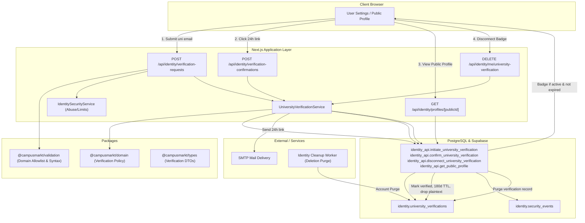

# University Verification Design

**Spec**: `.specs/features/003-university-verification/spec.md`  
**Status**: Draft

---

## Architecture Overview

Feature `003-university-verification` introduces an optional academic affiliation trust signal for CampusMarkt accounts, starting with **TU Braunschweig**. The architecture adheres to project decisions **AD-001** through **AD-007**: business rules live in transport-neutral application and domain libraries, Supabase Auth and database mutations run behind the Next.js BFF and server-side RPC boundary, and data minimization ensures institutional emails are never persisted in plaintext after verification or returned to browser clients.



---

## Approach Exploration

### Approach 1 (Recommended): Dedicated Verification Entity with Query-Time Expiry & Normalized Hash Uniqueness

- **Data Model**: A dedicated table `identity.university_verifications` keyed by `auth_user_id` (foreign key to `identity.accounts` on delete cascade).
- **Email Privacy**: Store only the normalized HMAC-SHA-256 hash (`institutional_email_hash`) computed with the server-side `IDENTITY_HASH_PEPPER`. Plaintext institutional emails are discarded immediately after confirmation.
- **Uniqueness**: Enforce 1:1 uniqueness at database level: no two active verifications (`status = 'verified'` and `expires_at > clock_timestamp()`) may share the same `institutional_email_hash`.
- **Query-Time Expiry**: Public profile and account queries evaluate expiration dynamically (`status = 'verified' AND expires_at > transaction_timestamp()`). This guarantees instant badge disappearance after 6 months (180 days) without race conditions or batch polling lag.
- **Reverification**: The user can initiate reverification prior to or after expiration. The existing badge remains visible until the new verification is confirmed.
- **Lifecycle Integration**: Cascades on account deletion automatically. Voluntary disconnection immediately drops the record and releases the hash.

### Approach 2: Profile Column Extension
- Embed verification fields directly in `identity.profiles`.
- **Trade-off**: Increases `profiles` table bloat; makes pending verification, token association, and hash-based uniqueness difficult to isolate; couples general public identity to optional academic trust signals.

### Approach 3: Background Worker Expiration Polling
- Rely on a cron or daemon worker to update expired rows from `verified` to `expired`.
- **Trade-off**: Creates a lag window where an expired student continues to show a valid badge between cron intervals.

**Decision**: Adopt **Approach 1**. It guarantees atomic correctness, immediate expiration reflection, strict data minimization, and clean separation of concerns.

---

## Code Reuse Analysis

### Existing Components to Leverage

| Component | Location | How to Use |
| --- | --- | --- |
| `IdentitySecurityService` | `apps/web/src/modules/identity/security/index.ts` | Reuse `enforce()` for dual rate limits (account and IP) and `audit()` for recording verification events with HMAC-SHA-256 fingerprints. |
| Email normalization & hashing | `packages/validation`, `apps/web/src/modules/identity/security/index.ts` | Reuse `normalizeEmail` and `fingerprintIdentity` with `IDENTITY_HASH_PEPPER`. |
| Action link staging & tokens | `apps/web/src/modules/identity/infrastructure/action-links.ts` | Reuse token generation (`crypto.randomBytes(32)`), SHA-256 hashing, and staging cookie pattern. |
| HTTP error handling & context | `apps/web/src/modules/identity/http/index.ts` | Reuse `createIdentityHttpContext`, `validateMutationRequest`, `IdentityHttpBoundaryError`, and standard response envelopes. |
| Mail delivery adapter | `apps/web/src/modules/identity/infrastructure/smtp/` | Reuse nodemailer/Inbucket SMTP transport for verification message delivery. |
| Identity cleanup worker | `apps/web/src/modules/identity/worker/` | Leverage existing cascade from `identity.accounts` on delete cascade for verification records. |

### Integration Points

| System | Integration Method |
| --- | --- |
| `identity.accounts` | `identity.university_verifications.auth_user_id` foreign key with `ON DELETE CASCADE`. |
| `identity_api.get_public_profile` | Updated to join `identity.university_verifications` and return `university_id` and `badge_label` if currently active and unexpired. |
| Web UI Shell | Extended `/account` dashboard to display current status (unverified, active, expired), days remaining, and reverify / disconnect actions; updated `/profiles/[id]` with badge rendering. |

---

## Data Models & Schema Design

### 1. `identity.university_verifications`

```sql
create table identity.university_verifications (
  auth_user_id uuid primary key
    references identity.accounts(auth_user_id) on delete cascade,
  university_id text not null,
  institutional_email_hash text not null,
  status text not null
    check (status in ('pending', 'verified', 'revoked')),
  token_hash bytea
    check (token_hash is null or octet_length(token_hash) = 32),
  token_expires_at timestamptz,
  verified_at timestamptz,
  expires_at timestamptz,
  created_at timestamptz not null default transaction_timestamp(),
  updated_at timestamptz not null default transaction_timestamp(),
  check (
    (status = 'pending' and token_hash is not null and token_expires_at is not null) or
    (status in ('verified', 'revoked') and token_hash is null and token_expires_at is null)
  ),
  check (expires_at is null or expires_at > verified_at)
);

create index university_verifications_email_hash_idx
  on identity.university_verifications (institutional_email_hash);

create index university_verifications_active_badge_idx
  on identity.university_verifications (auth_user_id, status, expires_at);

alter table identity.university_verifications enable row level security;
alter table identity.university_verifications force row level security;
revoke all on table identity.university_verifications from public, anon, authenticated;
```

### 2. Database RPC Functions

1. `identity_api.initiate_university_verification(requested_auth_user_id uuid, requested_university_id text, requested_email_hash text, requested_token_hash bytea)`:
   - Verifies account is in `active_confirmed` state.
   - Checks that `requested_email_hash` is not already verified by another account (`status = 'verified' and expires_at > clock_timestamp()`).
   - Sets 24-hour token expiry: `token_expires_at = transaction_timestamp() + interval '24 hours'`.
   - Inserts or updates pending verification row for `requested_auth_user_id`.
2. `identity_api.confirm_university_verification(requested_token_hash bytea)`:
   - Finds pending record matching `token_hash` where `token_expires_at > transaction_timestamp()`.
   - Re-checks that `institutional_email_hash` is not claimed by another active verified account.
   - Sets `status = 'verified'`, `verified_at = transaction_timestamp()`, `expires_at = transaction_timestamp() + interval '180 days'`.
   - Clears `token_hash` and `token_expires_at`.
   - Returns public verification DTO.
3. `identity_api.disconnect_university_verification(requested_auth_user_id uuid)`:
   - Deletes the verification row for the authenticated owner.
4. `identity_api.get_public_profile(requested_public_id uuid)`:
   - Updated to left join `identity.university_verifications` where `status = 'verified' and expires_at > transaction_timestamp()`.
   - Returns `university_id` and `badge_label` (e.g. `'tu-braunschweig'`, `'TU Braunschweig'`) when active; `null` otherwise.

---

## Component Specifications

### 1. Domain Policy (`packages/domain/src/identity/university.ts`)
- **Institution Definitions**:
  ```typescript
  export interface SupportedUniversity {
    id: "tu-braunschweig";
    name: "TU Braunschweig";
    badgeLabel: "TU Braunschweig";
    acceptedDomains: readonly ["tu-braunschweig.de", "tu-bs.de"];
  }
  ```
- **Policy Constants**:
  - `UNIVERSITY_VERIFICATION_TOKEN_TTL_SECONDS = 24 * 60 * 60` (24 hours)
  - `UNIVERSITY_VERIFICATION_VALIDITY_SECONDS = 180 * 24 * 60 * 60` (180 days / 6 months)
- **Lifecycle Evaluation**:
  - `isUniversityVerificationActive(verification: { status: string; expiresAt: Date }, now: Date): boolean`
    - Returns `true` iff `verification.status === "verified" && now.getTime() < verification.expiresAt.getTime()`.

### 2. Validation (`packages/validation/src/identity/university/index.ts`)
- `validateInstitutionalEmail(email: string): ParseResult<{ email: string; domain: string; universityId: string }>`:
  - Trims whitespace, lowercases.
  - Validates email syntax (RFC 5322 compatible, max 254 chars).
  - Checks domain against `SUPPORTED_UNIVERSITIES` allowlist.
  - Rejects delimiter attacks (multiple `@`, control characters, newlines).

### 3. Application Service (`UniversityVerificationService`)
- Location: `apps/web/src/modules/identity/application/university/index.ts`
- **Methods**:
  - `initiateVerification(authUserId: string, input: { institutionalEmail: string }, context: IdentityHttpContext)`:
    - Normalizes & validates institutional email.
    - Computes HMAC-SHA-256 hash using `IDENTITY_HASH_PEPPER`.
    - Enforces rate limits (3/hr per account, 30/hr per IP) via `IdentitySecurityService`.
    - Calls `identity_api.initiate_university_verification`.
    - Dispatches verification email with action link containing random token.
    - Records audit event (`university_verification_initiated`).
  - `confirmVerification(token: string, context: IdentityHttpContext)`:
    - Hashes token with SHA-256.
    - Calls `identity_api.confirm_university_verification`.
    - Records audit event (`university_verification_confirmed`).
    - Returns `{ status: "verified", universityId: "tu-braunschweig", badgeLabel: "TU Braunschweig", expiresAt: string }`.
  - `disconnectVerification(authUserId: string, context: IdentityHttpContext)`:
    - Calls `identity_api.disconnect_university_verification`.
    - Records audit event (`university_verification_disconnected`).

### 4. HTTP Routes (`apps/web/src/app/api/identity/`)
- `POST /api/identity/university-verifications`: Initiate verification.
- `POST /api/identity/university-verifications/confirm`: Confirm verification.
- `DELETE /api/identity/me/university-verification`: Disconnect verification.
- `GET /api/identity/me/university-verification`: Query current account verification status (active, expired, pending, or none).

---

## Risks & Concerns

| Risk | Impact | Mitigation in this Design |
| --- | --- | --- |
| Institutional email enumeration | Attacker checks if a student email exists in CampusMarkt | Initiation returns generic accepted outcome; collision errors on active accounts use non-disclosing messages; audit logs drop raw emails. |
| Header injection in email delivery | Malicious local-part manipulates SMTP headers | Validation rejects CRLF (`\r`, `\n`) and non-printable characters in email inputs before SMTP dispatch. |
| Email bombing / inbox flooding | Script initiates repeated requests to victim's student email | Dual rate limits (3/hour per account, 30/hour per IP) enforced at database boundary before email dispatch. |
| Race condition on concurrent confirmation | Two browser tabs or parallel requests confirm simultaneously | Database transaction locks pending record; updates atomically; second request receives safe already-consumed outcome. |
| Stale badge caching | Public profile caches badge after 6-month expiry | Public profile RPC computes validity dynamically against `transaction_timestamp()`; HTTP cache-control headers on profile APIs enforce fresh validation. |

---

## Traceability to Requirements

| Requirement | Design Component / Mechanism |
| --- | --- |
| **UNIV-01** | `validateInstitutionalEmail` (TU Braunschweig domain matching), `identity_api.initiate_university_verification`, 24h token generation, SMTP email delivery. |
| **UNIV-02** | `identity_api.confirm_university_verification` setting `expires_at = now() + 180 days`, HMAC-SHA-256 hash storage, plaintext discarding. |
| **UNIV-03** | `identity_api.get_public_profile` dynamic badge projection; complete omission of institutional email and token from DTOs. |
| **UNIV-04** | Query-time expiration check (`expires_at > now()`); account dashboard reverification action; renewal extending expiration 180 days. |
| **UNIV-05** | `identity_api.disconnect_university_verification`; `ON DELETE CASCADE` from `identity.accounts` on worker purge. |
| **UNIV-06** | `IdentitySecurityService` dual rate limits; HMAC-SHA-256 pseudonymous audit logging; header-injection validation; bounded 503 on SMTP failure. |
