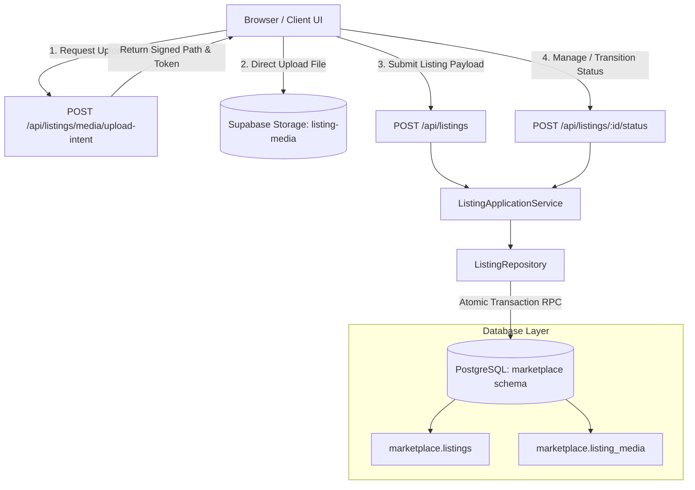

# Listing Creation and Management Design

**Spec**: `.specs/features/004-listing-creation-management/spec.md`
**Status**: Approved

---

## Architecture Overview

Feature `004-listing-creation-management` implements the physical goods inventory foundation for CampusMarkt V1 using Approach A (Two-Phase Direct Storage Upload with Atomic Database RPCs).



### Key Architectural Boundaries

1. **Transport & Client Agnostic Domain**:
   - `packages/domain/src/listings/`: Pure business rules, listing type invariants, price rules, status state machine, image constraints.
   - `packages/types/src/listings/`: Transport DTOs, listing entities, enums (`ListingType`, `ListingStatus`, `ListingCategory`, `PickupArea`, `ItemCondition`), and type predicates.
   - `packages/validation/src/listings/`: Schemas for listing creation, updates, and status transitions with sanitization.
2. **Server-Side Application Layer**:
   - `apps/web/src/modules/listings/application/`: Coordinates auth context verification (ensuring user is confirmed and not deletion pending), repository calls, rate limiting (20/hr), and audit logging.
3. **Database & Storage Boundary**:
   - PostgreSQL schema `marketplace` (isolated from public) with forced RLS and cascade on user account deletion.
   - Public RPC schema `marketplace_api` with `security definer` RPCs strictly validating caller `auth.uid()`.
   - Supabase Storage bucket `listing-media` with owner-scoped write RLS policies.

---

## Code Reuse Analysis

### Existing Components to Leverage

| Component | Location | How to Use |
| --- | --- | --- |
| Database Client & Credentials | `apps/web/src/modules/identity/server/supabase.ts` | Reuse server-side Supabase client pattern for authenticated DB and Storage calls. |
| Account State Verification | `identity.accounts` table & RPC patterns | Verify that `auth.uid()` has `state = 'active_confirmed'` and `deletion_requested_at is null` before allowing mutations. |
| Validation Helpers | `packages/validation/src/` | Reuse string trimming, sanitization, and error formatting conventions. |
| Audit Logging & Telemetry | `apps/web/src/modules/identity/server/` | Follow structured JSON audit pattern (`event_name`, `entity_id`, timestamp, non-PII attributes). |
| University Trust Badge Projector | `packages/types/src/identity/university.ts` | Project `university_id` and `badge_label` on owner listing responses without exposing raw email or hash. |

---

## Components and Interfaces

### 1. Domain Layer (`packages/domain/src/listings/`)

- **Types & Enums**:
  - `ListingType`: `'SELL' | 'GIVE_AWAY' | 'WANTED'`
  - `ListingStatus`: `'active' | 'reserved' | 'sold' | 'archived'`
  - `ListingCategory`: `'furniture' | 'electronics' | 'books_studies' | 'bicycles_mobility' | 'clothing' | 'home_kitchen' | 'other'`
  - `PickupArea`: `'innenstadt' | 'campus_tu_altgebaeude' | 'campus_nord_bienrode' | 'oestliches_ringgebiet' | 'westliches_ringgebiet' | 'noerdliches_ringgebiet_siegfriedviertel' | 'viewegs_garten_bebelhof' | 'heidberg_melverode' | 'weststadt' | 'lehndorf_kanzlerfeld'`
  - `ItemCondition`: `'NEW' | 'LIKE_NEW' | 'GOOD' | 'FAIR'`
- **Invariants & Transition Guards**:
  - `validatePriceRule(type, priceCents)`:
    - `SELL`: `priceCents !== null && priceCents >= 50 && priceCents <= 1_000_000` (€0.50 to €10,000.00).
    - `GIVE_AWAY`: `priceCents === null || priceCents === 0`.
    - `WANTED`: `priceCents === null || (priceCents >= 50 && priceCents <= 1_000_000)`.
  - `validateImageCount(type, imageCount)`:
    - `SELL` & `GIVE_AWAY`: `imageCount >= 1 && imageCount <= 8`.
    - `WANTED`: `imageCount >= 0 && imageCount <= 8`.
  - `canTransitionStatus(from, to)`:
    - `active` -> `reserved` (allowed)
    - `active` -> `sold` (allowed)
    - `active` -> `archived` (allowed)
    - `reserved` -> `active` (allowed)
    - `reserved` -> `sold` (allowed)
    - `reserved` -> `archived` (allowed)
    - `sold` -> `archived` (allowed)
    - All other transitions rejected.

### 2. Database Schema & RPCs (`supabase/migrations/`)

#### Schema `marketplace`

```sql
create schema if not exists marketplace;
create schema if not exists marketplace_api;

create table marketplace.listings (
  id uuid primary key default gen_random_uuid(),
  owner_id uuid not null references identity.accounts(auth_user_id) on delete cascade,
  listing_type text not null check (listing_type in ('SELL', 'GIVE_AWAY', 'WANTED')),
  title text not null check (char_length(title) between 5 and 100),
  description text not null check (char_length(description) between 10 and 2000),
  category text not null,
  pickup_area text not null,
  condition text not null check (condition in ('NEW', 'LIKE_NEW', 'GOOD', 'FAIR')),
  price_cents integer check (price_cents is null or price_cents between 0 and 1000000),
  status text not null default 'active' check (status in ('active', 'reserved', 'sold', 'archived')),
  created_at timestamptz not null default transaction_timestamp(),
  updated_at timestamptz not null default transaction_timestamp()
);

create table marketplace.listing_media (
  id uuid primary key default gen_random_uuid(),
  listing_id uuid not null references marketplace.listings(id) on delete cascade,
  storage_path text not null,
  position smallint not null check (position between 0 and 7),
  created_at timestamptz not null default transaction_timestamp(),
  unique (listing_id, position),
  unique (listing_id, storage_path)
);
```

#### RPCs in `marketplace_api`

1. `marketplace_api.create_listing(p_payload jsonb)`:
   - Verifies caller account state.
   - Inserts into `marketplace.listings`.
   - Inserts up to 8 rows into `marketplace.listing_media`.
   - Returns created listing ID and details.
2. `marketplace_api.update_listing(p_listing_id uuid, p_payload jsonb)`:
   - Verifies owner equality (`owner_id = auth.uid()`).
   - Verifies `listing_type` cannot be changed.
   - Updates mutable fields.
   - Replaces/reorders `marketplace.listing_media` rows.
3. `marketplace_api.transition_listing_status(p_listing_id uuid, p_target_status text)`:
   - Verifies owner equality.
   - Validates state transition machine.
   - Updates `status` and `updated_at`.
4. `marketplace_api.get_owner_listing(p_listing_id uuid)`:
   - Returns full details for owner management view.
5. `marketplace_api.list_owner_listings()`:
   - Returns all listings owned by `auth.uid()`, ordered by `created_at desc`.

### 3. Server-Side Application & BFF Routes (`apps/web/`)

- `POST /api/listings/media/upload-intent`: Generates pre-signed upload URL for `listing-media` bucket after validating MIME type (`image/jpeg`, `image/png`, `image/webp`) and user auth.
- `POST /api/listings`: Validates payload and invokes `create_listing`.
- `GET /api/listings/mine`: Retrieves all listings owned by current user.
- `GET /api/listings/[id]/manage`: Retrieves single listing for owner management.
- `PATCH /api/listings/[id]`: Updates mutable fields.
- `POST /api/listings/[id]/status`: Executes status transition (`active`, `reserved`, `sold`, `archived`).

### 4. User Interface (`apps/web/src/app/listings/`)

- `/listings/new`:
  - Step-by-step or cohesive single-page form with live preview.
  - Type toggle: `SELL`, `GIVE_AWAY`, `WANTED`.
  - Dynamic price field (disabled for giveaway, marked optional for wanted).
  - Drag-and-drop image dropzone with reordering; primary cover preview at index 0.
  - Dropdowns for Category and Pickup Area.
  - Policy callout box advising against prohibited items.
- `/listings/[id]/manage`:
  - Status banner with quick toggle buttons: "Mark as Reserved", "Mark as Sold", "Archive".
  - Edit mode allowing modifications of all mutable fields and photo reordering.
- `/account/listings` (My Listings):
  - Card grid listing all user listings grouped by status (`Active`, `Reserved`, `Sold`, `Archived`).

---

## Risks & Concerns

| Risk | Impact | Mitigation |
| --- | --- | --- |
| Abandoned media uploads leading to storage orphans | High disk usage in Storage bucket | Store uploads with UUID prefix; schedule periodic orphan cleanup for unreferenced media objects older than 24 hours. |
| Malicious script injection in description or title | Stored XSS | Text inputs are strictly sanitized with HTML escaping both in validation schemas and React UI output. |
| Race condition on concurrent status updates | Inconsistent listing state | Use PostgreSQL row locks (`for update`) in transition RPCs and optimistic locking check on `updated_at`. |
| Excessive listing creation spam | Marketplace pollution | Apply application-level rate limiting (max 20 listings per user per hour). |
