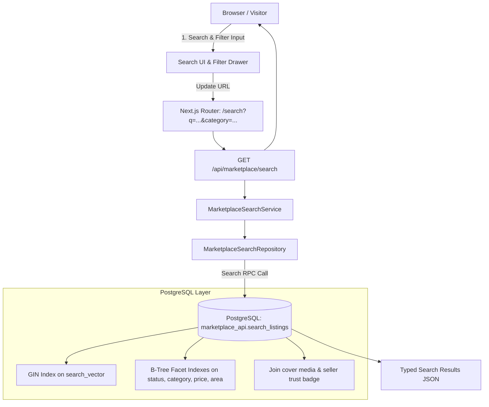

# Search and Filters Design

**Spec**: `.specs/features/006-search-filters/spec.md`
**Status**: Approved

---

## Architecture Overview

Feature `006-search-filters` delivers full-text keyword search and multi-facet filtering for CampusMarkt V1, adopting the unanimous verdict of **The Jury** (Option A: PostgreSQL Native FTS with Stored `tsvector` and GIN Index).



### Key Architectural Boundaries

1. **Database Search Engine (`marketplace` & `marketplace_api`)**:
   - `search_vector`: Stored generated column on `marketplace.listings` defined as:
     ```sql
     search_vector tsvector generated always as (
       setweight(to_tsvector('german', coalesce(title, '')), 'A') ||
       setweight(to_tsvector('german', coalesce(description, '')), 'B')
     ) stored;
     ```
   - Partial GIN Index: `USING gin (search_vector) WHERE status IN ('active', 'reserved')`.
   - RPC `marketplace_api.search_listings`: Safely parses user queries via `websearch_to_tsquery('german', p_query)`, applies facet array filters (`categories`, `pickup_areas`, `conditions`, `listing_types`, `price_range`, `verified_only`), and orders results by `relevance`, `newest`, `price_asc`, or `price_desc`.
2. **Deterministic Keyset Cursor for Search**:
   - Keyset cursor encodes `(rank, created_at, id)` when sorting by relevance, or `(created_at, id)` when sorting chronologically.
3. **Application Layer & Server-Side Security**:
   - `MarketplaceSearchService`: Rate limits public searches to 60 req/min per IP, sanitizes input, and emits structured search telemetry.
4. **URL Synchronization & Reactive UI**:
   - Bi-directional synchronization between React search state and URL search params (`useSearchParams`, `useRouter.replace`).
   - Accessible mobile bottom-sheet drawer (360px) and desktop filter bar (1280px) with active filter badges and one-click reset.

---

## Code Reuse Analysis

### Existing Components to Leverage

| Component | Location | How to Use |
| --- | --- | --- |
| Listing Card Component | `apps/web/src/components/marketplace/feed.tsx` | Reuse `ListingCard` to display search result items consistently. |
| Public Listing DTOs | `packages/types/src/listings/feed.ts` | Reuse `PublicFeedItem` and `PublicListingSeller` shapes for search result projections. |
| Category & Area Formatters | `packages/domain/src/listings/feed.ts` | Reuse human-readable German and English label formatters. |
| Supabase Server Client | `apps/web/src/modules/identity/server/supabase.ts` | Reuse server-side Supabase client for authenticated and anonymous RPC calls. |

---

## Components and Interfaces

### 1. Types & DTOs (`packages/types/src/listings/search.ts`)

```typescript
import type { PublicFeedItem } from "./feed";

export type SearchSortOption = "relevance" | "newest" | "price_asc" | "price_desc";

export interface SearchFilters {
  query?: string;
  categories?: string[];
  pickupAreas?: string[];
  listingTypes?: ("SELL" | "GIVE_AWAY" | "WANTED")[];
  conditions?: ("NEW" | "LIKE_NEW" | "GOOD" | "FAIR")[];
  minPriceCents?: number;
  maxPriceCents?: number;
  verifiedOnly?: boolean;
  sort?: SearchSortOption;
  cursor?: string;
  limit?: number;
}

export interface SearchResultsResponse {
  items: PublicFeedItem[];
  totalEstimate?: number;
  nextCursor: string | null;
  appliedFilters: SearchFilters;
}
```

### 2. Validation (`packages/validation/src/listings/search.ts`)

- `validateSearchParams(params: unknown)`: Validates and sanitizes:
  - `q`: string trimmed to max 100 characters.
  - `categories`: array of valid `ListingCategory`.
  - `pickupAreas`: array of valid `PickupArea`.
  - `conditions`: array of valid `ItemCondition`.
  - `listingTypes`: array of valid `ListingType`.
  - `minPriceCents`, `maxPriceCents`: non-negative integer cents with guard `minPrice <= maxPrice`.
  - `verifiedOnly`: boolean.
  - `sort`: allowed enum (`relevance`, `newest`, `price_asc`, `price_desc`).
  - `limit`: clamped to `1..50` (default: 20).

### 3. Database Schema & RPCs (`supabase/migrations/`)

#### Migration: Generated `search_vector` and GIN Index

```sql
alter table marketplace.listings
  add column if not exists search_vector tsvector
  generated always as (
    setweight(to_tsvector('german', coalesce(title, '')), 'A') ||
    setweight(to_tsvector('german', coalesce(description, '')), 'B')
  ) stored;

create index if not exists listings_search_vector_gin_idx
  on marketplace.listings using gin (search_vector)
  where status in ('active', 'reserved');

create index if not exists listings_price_cents_idx
  on marketplace.listings (price_cents)
  where status in ('active', 'reserved');

create index if not exists listings_condition_idx
  on marketplace.listings (condition)
  where status in ('active', 'reserved');
```

#### RPC: `marketplace_api.search_listings`

Parameters:
- `p_query text default null`
- `p_categories text[] default null`
- `p_pickup_areas text[] default null`
- `p_listing_types text[] default null`
- `p_conditions text[] default null`
- `p_min_price_cents integer default null`
- `p_max_price_cents integer default null`
- `p_verified_only boolean default false`
- `p_sort text default 'relevance'`
- `p_cursor_rank real default null`
- `p_cursor_created_at timestamptz default null`
- `p_cursor_id uuid default null`
- `p_limit integer default 20`

Returns the projected listing rows joining cover media (`position = 0`), seller public profile, and active TU Braunschweig trust badge.

### 4. Server Services & API Routes (`apps/web/`)

- `MarketplaceSearchRepository`: Invokes `marketplace_api.search_listings`.
- `MarketplaceSearchService`: Enforces rate limiting (60 req/min per IP) and logs search metrics.
- Route Handler: `GET /api/marketplace/search`
  - Accepts URL search params.
  - Returns `SearchResultsResponse` with `Cache-Control: public, s-maxage=30, stale-while-revalidate=60`.

### 5. UI Components (`apps/web/src/components/marketplace/search/`)

- `SearchBar`: Responsive search input with search icon, clear button, and debounced trigger.
- `FilterDrawer`: Slide-over drawer on mobile viewports with category checkboxes, area checkboxes, price min/max inputs, condition selector, and TU Braunschweig badge toggle.
- `FilterBar`: Desktop toolbar with active filter pill chips and clear-all action.
- `SearchResultsView`: Grid of `ListingCard` items with search summary ("14 Inserate gefunden für 'Fahrrad'"), sort dropdown, and empty state.

---

## Risks & Concerns

| Risk | Impact | Mitigation |
| --- | --- | --- |
| Malformed search strings causing SQL syntax errors | Database 500 error | Parse all user inputs through PostgreSQL `websearch_to_tsquery('german', ...)`, which safely converts operators (`OR`, `-`, quotes) without throwing syntax errors. |
| Inverted price bounds (`minPrice > maxPrice`) | Confusing zero results or invalid SQL | Schema validation rejects inverted bounds with HTTP 400 before querying the database. |
| GIN index bloat on frequent updates | Slower write transactions | Stored generated column is only recalculated on `title` or `description` updates; status transitions (`active` -> `reserved`) do not re-index the text vector. |
| Aggressive automated scraping via search endpoints | PostgreSQL CPU saturation | Enforce application-level IP rate limiting (60 req/min) and max limit per request (50). |
