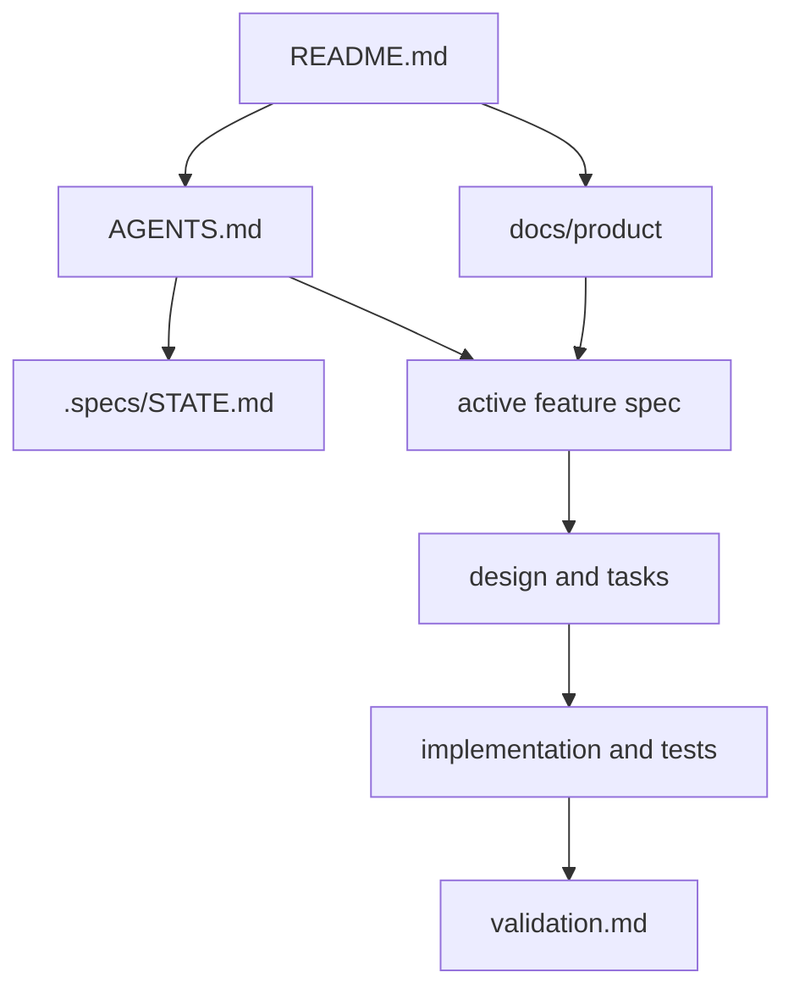
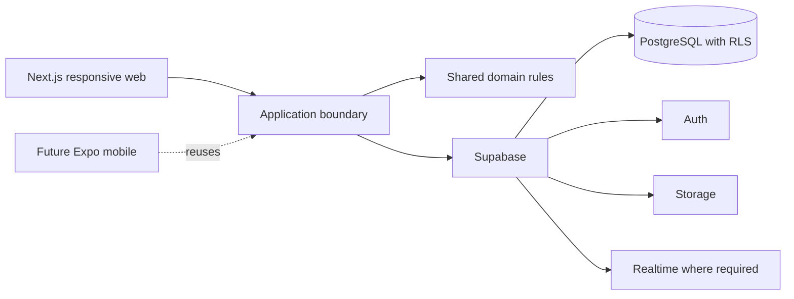

# Project Foundation Design

**Spec:** `.specs/features/project-foundation/spec.md`  
**Status:** Approved from the referenced planning conversation and the explicit request to create the foundation

## Architecture Overview

The repository separates durable product knowledge from feature-delivery evidence. `README.md` and `AGENTS.md` are short entry points. `docs/product/` owns cross-feature product truth. `.specs/STATE.md` owns hard-to-reverse project decisions and the current handoff. Each later capability receives a lazy `.specs/features/<feature>/` directory only when work begins.

## Approach Exploration

| Approach | Advantages | Costs | Decision |
| --- | --- | --- | --- |
| One large product specification | One file to find | Mixes stable product truth, architecture, and changing feature requirements | Rejected |
| Product knowledge in `docs/` plus TLC feature artifacts in `.specs/` | Clear ownership, lazy feature files, native traceability and validation | Requires cross-links and disciplined updates | Selected |
| Keep both Spec Kit and TLC structures | Preserves the earlier proposal | Competing sources of truth and duplicated workflow | Rejected |

## Target Runtime Direction

The foundation records, but does not implement, this agreed direction:

The first code feature will choose and pin current stable package versions. Supabase's current guidance requires a project-scoped CLI, cookie-based SSR support for Next.js, explicit Data API exposure where configured, RLS on exposed tables, ownership predicates in policies, and no secret or service-role key in browser code. Schema features must use typed keys, timezone-aware timestamps, exact numeric money values, constraints, and indexes on foreign keys and RLS predicates.

## Code Reuse Analysis

### Existing Components to Leverage

| Component | Location | How to Use |
| --- | --- | --- |
| Repository title | `README.md` | Preserve the CampusMarkt name and expand it into the navigation entry point. |
| Product placeholders | `docs/product/00-product-vision.md`, `docs/product/01-domain-model.md` | Populate the user-created files instead of replacing their paths. |
| Repository instructions | `AGENTS.md` | Preserve the instruction to terminate terminals and test processes after use. |

### Integration Points

| System | Integration Method |
| --- | --- |
| Product docs | Relative links from README and AGENTS. |
| TLC memory | `.specs/STATE.md` active decisions constrain later designs. |
| Feature delivery | Each feature links back to the relevant product documents and traces ACs through tasks and validation. |

## Components

### Repository entry point

- **Purpose**: Explain project purpose, maturity, document map, and how development proceeds.
- **Location**: `README.md`
- **Dependencies**: All six product documents.
- **Reuses**: Existing project title.

### Agent navigation guide

- **Purpose**: Tell agents what to read and which scope and execution rules are non-negotiable.
- **Location**: `AGENTS.md`
- **Dependencies**: Product document map and `.specs/STATE.md`.
- **Reuses**: Existing terminal lifecycle instruction.

### Product knowledge base

- **Purpose**: Preserve vision, domain language, MVP scope, policy, roadmap, and deferred capabilities.
- **Location**: `docs/product/00-product-vision.md` through `docs/product/05-future-capabilities.md`
- **Dependencies**: Confirmed conversation decisions.
- **Reuses**: Existing placeholder paths.

## Data Models

No runtime model is created in this feature. The domain document defines conceptual ownership and state boundaries only. Concrete PostgreSQL tables, constraints, indexes, and RLS policies belong to the feature that first persists each concept.

## Error Handling Strategy

| Error Scenario | Handling | User Impact |
| --- | --- | --- |
| Required document is missing or empty | Final integrity gate fails. | Foundation cannot be marked complete. |
| Product docs and feature spec conflict | Approved feature spec wins for that feature; product docs receive a follow-up reconciliation task. | No silent divergence. |
| Future behavior lacks a decision | Record it as deferred or an explicit assumption. | No invented permanent behavior. |
| External API guidance changes | Verify current official docs in the owning implementation feature. | No stale framework contract is treated as fact. |

## Risks & Concerns

| Concern | Location | Impact | Mitigation |
| --- | --- | --- | --- |
| The repository has no application code or test tooling yet. | `README.md:1` | Runtime architecture and gate commands cannot be proven in this feature. | Keep this feature documentation-only and create tooling in the first application-bootstrap spec. |
| Existing product files are empty placeholders. | `docs/product/00-product-vision.md:1` | Later agents currently lack product truth. | Populate both files and add the remaining four documents atomically. |
| Supabase and its JavaScript packages change frequently. | `.specs/STATE.md` AD-002 | Stale setup advice can break authentication or data access. | Do not pin APIs here; recheck official docs and changelog before implementation. |
| Marketplace workflows contain undefined timing and transition rules. | `.specs/features/project-foundation/context.md` | Premature schema choices could lock in incorrect states. | Defer exact transitions to offers, reservations, verification, and payment specs. |

## Tech Decisions

| Decision | Choice | Rationale |
| --- | --- | --- |
| Knowledge architecture | `docs/product/` plus `.specs/` | Separates stable product truth from feature execution evidence. |
| Empty future specifications | Do not create them | TLC artifacts are lazy and empty files falsely signal completed phases. |
| Runtime versions | Defer to first code feature | Current official APIs must be verified immediately before use. |
| Supabase security baseline | RLS, explicit grants, owner checks, server-only secret keys | The browser may reach the Data API, so authorization must hold at the data boundary. |
