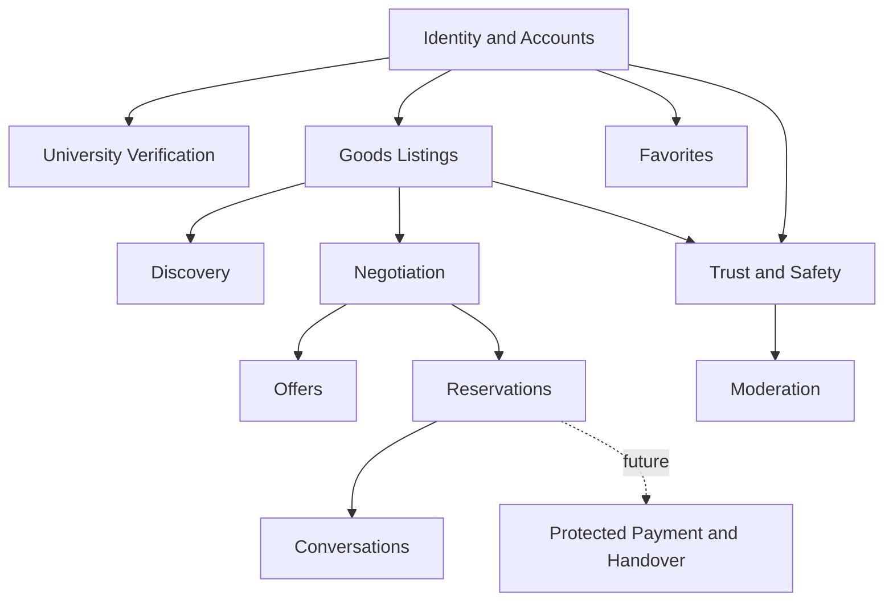

# CampusMarkt Domain Model

## Purpose

This document defines shared product language and conceptual boundaries. It is not a database schema. A concept becomes code, a table, or a production state only when an approved feature specification requires it.

## Context Map



## Actors

### Visitor

An unauthenticated person who can browse, search, filter, and view public marketplace content.

### Registered User

An authenticated person who can participate in the supported marketplace. University affiliation is not required.

### Verified Student

A registered user with a current, optional university verification. Verification adds a visible trust badge and no additional standard marketplace access.

### Moderator

An authorized operator who reviews reports and applies documented moderation actions. Moderator authority must come from trusted server-managed authorization data, never user-editable profile metadata.

## Core Concepts

### User Account

Owns authentication identity and private account operations.

- Uses a primary email for sign-in, recovery, and normal account notifications.
- Does not expose the primary email in public profiles or listings.
- Owns a public profile, listings, favorites, conversations, offers, reservations, and reports as their feature specifications define.

### Public Profile

The public marketplace identity of a registered user.

- Contains only display-safe fields approved by the profile feature.
- Can display a current university badge.
- Never displays the primary account email or institutional verification email.

### University

A supported institution that can issue a verification trust signal.

Conceptual attributes include a stable identifier, display name, accepted institutional domains, badge label, and active verification support. V1 begins with TU Braunschweig while allowing later institutions through explicit configuration and specs.

### University Verification

Evidence that one account controlled an accepted institutional email address at a point in time.

Conceptual attributes:

```text
user_id
university_id
institutional_email_hash
verified_at
expires_at
status
```

Rules:

- The institutional email is separate from the primary account email.
- It is used only for verification, security, abuse prevention, and legal retention requirements.
- It is never publicly displayed or silently adopted as the account's communication address.
- One normalized institutional email identity cannot verify multiple active accounts.
- The expected validity period is 12 months. The verification feature must confirm the exact expiry and reverification behavior before implementation.
- Expiry removes the visible badge. It does not remove the account or ordinary marketplace access.
- Plaintext retention after confirmation must be minimized and justified in the verification spec; a protected normalized hash is the preferred durable uniqueness mechanism.

Potential current states:

```text
PENDING -> VERIFIED -> EXPIRED
   |          |
   +------> REVOKED
```

Exact transition guards, retry limits, token expiry, and retention are owned by the university-verification feature.

### Listing

A user's public marketplace statement about one physical good.

Current listing intentions:

| Type | Meaning | Price rule | Primary response |
| --- | --- | --- | --- |
| `SELL` | Owner offers a physical good for money. | Exact asking price required. | Buy at asking price or make a structured offer. |
| `GIVE_AWAY` | Owner offers a physical good for free. | No price. | Express interest and request reservation. |
| `WANTED` | Requester describes a physical good they need. | Optional maximum budget only if its feature spec approves it. | Respond that the item is available. |

`SWAP` is a future type. It must not exist as a production enum value until its own feature defines two-sided goods, matching, withdrawal, and completion behavior.

Conceptual current states:

```text
DRAFT -> ACTIVE -> RESERVED -> SOLD
   |        |          |
   |        +------> ARCHIVED
   +---------------> ARCHIVED

ACTIVE or RESERVED -> REMOVED  (moderation only)
```

The listings feature must define valid owner actions, reservation release, relisting, archiving, and moderation guards before persistence.

### Listing Media

Ordered images owned by a listing. The earlier product discussion proposed one to eight images; the listings feature must confirm formats, size bounds, processing, accessibility text, deletion, and orphan cleanup.

### Category

A current goods classification used for discovery and policy enforcement. Categories cannot masquerade as future verticals. A `Services - coming soon` category does not belong in the V1 navigation.

### Pickup Area

A coarse Braunschweig area used for discovery and pickup planning. It is not the seller's precise private address. Exact meeting details belong in private conversation after participants choose to interact.

### Purchase Intent

A structured request to buy a `SELL` listing at its asking price. In V1, clicking Buy Now does not transfer money automatically. The seller accepts or declines the request; acceptance can create a reservation and open or reuse a conversation.

Concurrency rule: one accepted purchase intent or offer can reserve a listing at a time. The owning feature must enforce this atomically at the data boundary.

### Offer

A structured negotiation proposal, not merely a chat message.

```text
PENDING -> ACCEPTED
   |      -> DECLINED
   |      -> WITHDRAWN
   |      -> EXPIRED
   +----> COUNTERED -> new PENDING proposal
```

An accepted offer records the agreed amount and can create a reservation. The offers feature owns counteroffer lineage, expiry, duplicate submission, concurrency, and authorization rules.

### Reservation

The temporary exclusive association between one active listing and one prospective recipient after accepted purchase intent, accepted offer, or accepted free-item interest.

Conceptual current states:

```text
ACTIVE -> COMPLETED
   |    -> CANCELLED
   +--> EXPIRED  (only if an expiry policy is approved)
```

A reserved listing remains visible with a clear reserved state. Only authorized participants can change the reservation, and a seller can mark the physical good as sold or transferred according to the reservation feature.

### Transaction

The record of an agreed exchange and its completion outcome. V1 transactions coordinate local pickup and do not represent provider-processed funds.

Current conceptual path:

```text
AGREED -> PICKUP_PLANNING -> COMPLETED
   |              |
   +----------> CANCELLED
```

Future protected-payment states are documented separately and must not appear in V1 production code.

### Conversation and Message

A private communication channel between marketplace participants. Messages coordinate questions and pickup details; they do not replace structured offers, purchase intent, reservations, reports, or handover confirmation.

The messaging feature owns participant membership, read access, blocking behavior, rate limits, realtime delivery, retention, and moderation access.

### Favorite

A private association between a user and a listing. It has no effect on availability, ranking guarantees, or reservation state.

### Report

A user's structured safety or policy complaint about a listing or account. A report records category, target, reporter, context, and lifecycle without revealing reporter identity to the reported user.

### Moderation Case

An internal review that can act on reported listings or users according to policy. Exact actions, appeal behavior, audit evidence, and retention require a moderation spec.

## Marketplace Invariants

1. A user can modify only resources they own unless a moderator action is explicitly authorized.
2. A user cannot buy, offer on, or reserve their own listing.
3. `GIVE_AWAY` never carries a monetary price.
4. `SELL` requires an exact decimal asking price in euros.
5. Only one active reservation can control a listing at a time.
6. Structured state changes must be atomic and valid from the current state.
7. Public listing and profile data never reveal private email addresses or precise private addresses.
8. Verification affects trust display, not ordinary marketplace authorization.
9. Moderation removal and owner archiving are distinct outcomes.
10. Future concepts do not become current enum values, columns, routes, or UI until approved.

## Future Domain Concepts

These concepts are directional contracts only:

- `SWAP`: two-sided goods exchange.
- `MOVING_OUT`: rapid multi-listing and potential bundles.
- `MEETUP_SPOT`: curated public pickup location.
- `PROTECTED_PAYMENT`: provider-backed online payment.
- `HANDOVER_TOKEN`: one secure secret presented as QR or numeric code.
- `DISPUTE`: controlled exception path for a protected transaction.
- `SERVICES`, `HOUSING`, `JOBS`: separate marketplace verticals with different policies and models.

See [Future Capabilities](05-future-capabilities.md).

## Persistence Baseline for Later Features

When a feature first persists one of these concepts, its design must:

- Use primary keys appropriate to the access pattern and external exposure; do not default blindly to random UUIDv4 for every table.
- Use `timestamptz` for instants and exact `numeric` values for money.
- Express invariants with foreign keys, unique constraints, checks, and transactions where PostgreSQL can enforce them.
- Index foreign keys and columns used by common filters, ordering, uniqueness, and RLS predicates.
- Enable RLS on exposed tables and pair grants with explicit policies.
- Combine authenticated-role policies with ownership or permission predicates; `TO authenticated` alone is not authorization.
- Define both `USING` and `WITH CHECK` for ownership-preserving updates.
- Keep privileged functions out of exposed schemas, minimize `SECURITY DEFINER`, and revoke default execution when it is genuinely required.
- Treat public views as security-sensitive and use a safe invoker model or keep them unexposed.
- Keep service-role and secret keys on trusted servers only.

These are constraints for future schema specs, not permission to create the schema in advance.
