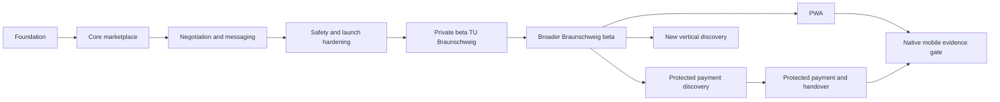

# CampusMarkt Roadmap

## Delivery Rule

The roadmap is evidence-led. A horizon starts only when the previous horizon meets its exit evidence, its owning feature specs are approved, and the repository has capacity to operate what it launches.

Dates are intentionally absent. Scope, safety, and learning gates control progression. Future horizons can change when product evidence changes.



## Horizon 0: Product Foundation

**Outcome**: The repository preserves product decisions, scope, policy, future boundaries, and a deterministic feature-delivery method.

**Entry evidence**: The referenced planning conversation contains confirmed product decisions, while the repository contains only a title and empty product-document placeholders.

**Deliverables**:

- Product vision and shared domain language.
- V1 boundary and feature sequence.
- Marketplace policy.
- Roadmap and future-capability contracts.
- TLC state, specification, design, tasks, atomic commits, and independent validation.

**Exit evidence**:

- Required documents are complete and cross-linked.
- Product and future scope are distinguishable without chat history.
- Foundation validators pass.

**Non-goals**: Application code, database schema, remote Supabase project, or deployment.

## Horizon 1: Web and Data Foundation

**Outcome**: A reproducible local project can build, test, and run a minimal responsive web shell against a local Supabase environment.

**Entry evidence**: Horizon 0 has a PASS validation report, and the product owner has approved starting the first runtime feature.

**Expected feature**: `001-web-supabase-foundation`

**Deliverables to specify**:

- Current stable Next.js and TypeScript setup.
- Workspace boundaries justified by actual reuse.
- Tailwind and accessible component baseline.
- Unit, integration, browser, lint, type, build, and database-policy gates.
- Supabase local configuration, migration workflow, generated database types, and seed strategy.
- Environment-variable contract with publishable client keys and server-only secrets separated.
- CI checks without remote deployment.

**Exit evidence**:

- A clean checkout can install pinned dependencies and reproduce local gates.
- The web shell works on specified mobile and desktop browser sizes.
- Local database reset is reproducible.
- No secret or remote resource is required for ordinary tests.

**Non-goals**: User accounts, marketplace tables, listings, or production deployment.

## Horizon 2: Identity, Profiles, and Verification

**Outcome**: People can create and use accounts safely, and TU Braunschweig students can add an optional current trust badge.

**Entry evidence**: Horizon 1 reproduces local web, test, and database gates from a clean checkout, including an authorization-test harness.

**Expected features**:

1. `002-identity-accounts`
2. `003-university-verification`

Public-safe profile behavior belongs to `002-identity-accounts`, matching the canonical sequence in [V1 Scope](02-mvp-scope.md#v1-feature-sequence).

**Deliverables to specify**:

- Registration, sign-in, sign-out, recovery, sessions, and abuse controls.
- Public-safe profile fields and ownership policies.
- Separate institutional-email verification, uniqueness, expiry, reverification, and privacy lifecycle.
- Authorization tests for visitor, owner, non-owner, moderator, and expired-verification cases.

**Exit evidence**:

- Unverified registered users retain standard access.
- Public APIs and pages never expose primary or institutional emails.
- RLS and route tests reject unauthorized reads and mutations.
- Verification delivery works through an approved email configuration, not a development-only default provider.

**Non-goals**: Listings, payment, broad university rollout, or verified-only marketplace access.

## Horizon 3: Goods Marketplace

**Outcome**: Users can publish supported physical goods, and visitors can find and understand them.

**Entry evidence**: Identity, public-profile ownership, and optional-verification boundaries have independent PASS reports.

**Expected features**:

1. `004-listing-creation-management`
2. `005-marketplace-feed-listing-details`
3. `006-search-filters`
4. `007-favorites`

Listing media belongs to `004-listing-creation-management` so upload lifecycle and listing ownership are delivered together.

**Deliverables to specify**:

- `SELL`, `GIVE_AWAY`, and `WANTED` validation and state transitions.
- Categories and coarse pickup areas.
- Ordered image upload, processing, authorization, deletion, and orphan cleanup.
- Recent public feed, details, text search, approved filters, and pagination.
- Private favorites.
- Prohibited and unsupported content guidance at creation time.

**Exit evidence**:

- Each listing type can complete its independent create-to-discovery journey.
- Invalid prices, ownership changes, media access, and state transitions are rejected at the proper boundary.
- Mobile creation and discovery journeys meet the accessibility baseline.
- Search and feed remain deterministic and paginate without duplicates or omissions under the specified ordering.

**Non-goals**: `SWAP`, services, personalized feed, bundles, or shipping.

## Horizon 4: Negotiation, Reservation, and Messaging

**Outcome**: Marketplace participants can move from interest to one clear local-pickup agreement without relying on ambiguous chat state.

**Entry evidence**: Supported listing types, ownership, discovery, search, and favorites have independent PASS reports and stable concurrency identifiers.

**Expected features**:

1. `008-purchase-intent-offers-reservations`
2. `009-messaging`
3. `010-pickup-completion`

Purchase intent, offers, and reservations share feature 008 because one atomic reservation invariant governs their accepted outcomes.

**Deliverables to specify**:

- Buy-at-asking-price request and seller response.
- Offer, counteroffer, acceptance, decline, withdrawal, and expiry rules.
- Atomic one-recipient reservation behavior under concurrent acceptance.
- Conversation membership, messaging, realtime behavior, retention, blocking, and rate limits.
- Safe pickup guidance and completion/cancellation evidence.

**Exit evidence**:

- Race-condition tests prove that one listing cannot receive two active reservations.
- Every state transition is authorized and rejects stale actions.
- Messages cannot substitute for structured offer or reservation state.
- No funds are represented as held, protected, released, or refunded.

**Non-goals**: Online payment, handover codes, disputes, ratings, or delivery.

## Horizon 5: Trust, Safety, Localization, and Launch Hardening

**Outcome**: CampusMarkt can support a controlled private beta with enforceable policy, safe core journeys, and observable product health.

**Entry evidence**: The complete goods, negotiation, messaging, and pickup journeys have PASS reports, and product owners have approved the beta policy review.

**Expected features**:

1. `011-reporting-blocking`
2. `012-moderation`
3. `013-localization-launch-hardening`

Accessibility, security, observability, and beta readiness are completion dimensions of feature 013 rather than separately numbered product features.

**Deliverables to specify**:

- Structured listing and account reports.
- Blocking behavior across discovery, messaging, offers, and reservations.
- Least-privilege moderator queue, actions, reasons, and audit records.
- Complete German and English core journeys.
- Accessibility, privacy, security, backup, incident, and operational checks.
- Approved beta metrics and feedback process.

**Exit evidence**:

- Policy-violating content can be reported and acted on through auditable paths.
- Moderator permissions cannot be self-assigned through user-editable metadata.
- Critical journeys pass in both languages and on approved mobile and desktop browsers.
- Product owners approve numeric supply, demand, liquidity, retention, completion, and safety targets.
- A privacy and legal review is complete for the launch geography and audience.

**Non-goals**: Public acquisition at scale, automated AI moderation, payment, or new cities.

## Horizon 6: Private Beta at TU Braunschweig

**Outcome**: A controlled community proves that the marketplace creates useful local matches safely.

**Entry evidence**: Features 001-013 are independently verified, legal and privacy reviews are complete, beta metrics are approved, and the operating team can support reports and incidents.

**Launch shape**:

- Seed supply with a small group of sellers and donors before broad buyer acquisition.
- Focus communication on students arriving, moving, or leaving.
- Observe listing quality, first-contact friction, offer behavior, reservation failures, no-shows, reports, and completed handovers.
- Support unverified users while measuring voluntary badge adoption.

**Exit evidence**:

- Approved liquidity and repeat-use targets are met across a sustained measurement window.
- Serious safety and privacy issues are understood and mitigated.
- Moderation workload is operable.
- Core drop-off points have evidence-backed improvement plans.

**Non-goals**: Multi-city growth or university partnership as a prerequisite. Adoption comes before institutional endorsement.

## Horizon 7: Broader Braunschweig Beta

**Outcome**: CampusMarkt serves a wider Braunschweig community without losing local relevance or trust.

**Entry evidence**: The TU Braunschweig private beta meets its approved liquidity, repeat-use, safety, and operational targets across the agreed measurement window.

**Potential work**:

- Add approved universities such as HBK Braunschweig or nearby Ostfalia communities through data and policy, not hard-coded UI branches.
- Refine pickup areas and discovery based on observed density.
- Introduce Moving Out as a separately specified capability if evidence shows repeated multi-item departure behavior.
- Prepare PWA installation if mobile-browser retention supports it.

**Exit evidence**:

- Supply and demand remain concentrated enough for useful matching.
- Multi-university verification remains understandable and privacy-safe.
- Operations, storage, realtime messaging, moderation, and database performance have sustainable margins.

**Non-goals**: Automatic national rollout, protected payment without discovery, or native mobile by assumption.

## Horizon 8: PWA

**Outcome**: Returning mobile-web users can install and reliably reopen CampusMarkt with an app-like entry point.

The PWA feature must specify installability, caching, updates, notification consent, offline behavior, privacy, and failure states. It must not promise offline marketplace transactions that depend on current server state.

**Entry evidence**: A material share of retained usage occurs on mobile web, and installation or notifications solve measured retention or response problems.

**Non-goals**: Native-only behavior, offline transaction mutation, or notification prompts without a specified user benefit and consent flow.

## Horizon 9: Protected Payment Discovery

**Outcome**: CampusMarkt decides whether protected online payment solves a verified user problem and selects a legally and operationally appropriate provider.

**Entry evidence**: The broader Braunschweig beta shows sustained completed handovers, measurable demand for online protection, and operational capacity for payment discovery.

**Required discovery**:

- User demand and willingness to pay.
- Provider marketplace capabilities in Germany and the EU.
- Seller onboarding, KYC/KYB, payouts, fees, tax information, refunds, chargebacks, disputes, and prohibited-business rules.
- Funds flow and custody responsibility.
- Reservation and cancellation semantics before and after funds are secured.
- Privacy, security, support, reconciliation, incident, and compliance obligations.

**Exit evidence**: A reviewed provider decision and approved payment, handover, cancellation, refund, and dispute specs.

**Non-goals**: Payment code, provider coupling, wallet-like language, or promises of protection before the provider and legal model are approved.

## Horizon 10: Protected Payment and Handover

**Outcome**: Eligible transactions can use provider-backed online payment and one secure physical-handover confirmation mechanism.

**Entry evidence**: Horizon 9 has an approved provider decision plus verified payment, cancellation, handover, refund, reconciliation, incident, and dispute specifications.

Expected sequence:

```text
Agreement
  -> provider payment authorization or collection
  -> funds secured under provider rules
  -> listing reserved
  -> pickup planned
  -> handover token presented as QR or numeric code
  -> authorized confirmation
  -> completion or dispute path
  -> provider release, refund, or other supported outcome
```

This horizon requires P0-level security, authorization, idempotency, concurrency, audit, and discrimination testing.

**Non-goals**: CampusMarkt custody of funds, storage of card data, unsupported payment methods, unreviewed countries, or ordinary moderators directly changing provider money state.

## Horizon 11: Native Mobile Evidence Gate

**Outcome**: Product evidence determines whether native iOS and Android clients offer enough value beyond the responsive web and PWA.

**Entry evidence**: Sustained retained mobile-web usage and measured value from push notifications, camera-heavy listing creation, device integration, or other native capabilities justify the additional client.

If approved, an Expo/React Native client reuses application contracts and domain rules. It does not duplicate business logic from Next.js components.

**Non-goals**: Rewriting marketplace rules for mobile, introducing native-only authorization behavior, or creating empty mobile scaffolding before a mobile feature is approved.

## Future Vertical Discovery

Services, housing, and jobs are separate product discoveries, not category toggles. Each needs its own users, risks, policy, data model, trust controls, and go-to-market evidence. See [Future Capabilities](05-future-capabilities.md).

## Roadmap Change Control

- Record a changed product direction in the owning product document.
- Add or supersede hard-to-reverse project decisions in `.specs/STATE.md`.
- Update affected specs before implementation.
- Do not silently pull a later-horizon capability into a current feature.
