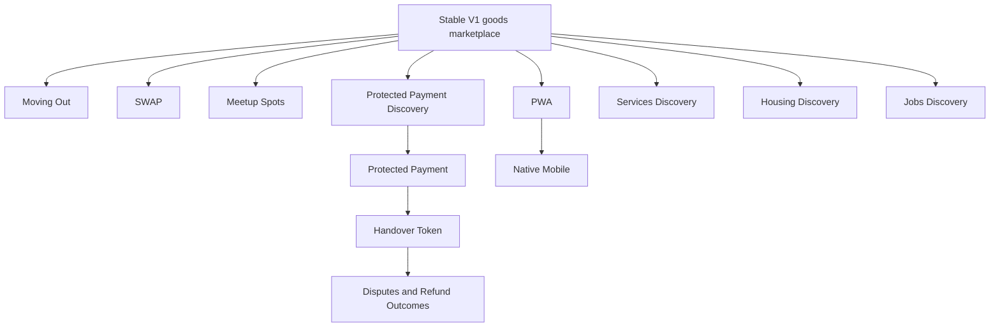

# CampusMarkt Future Capabilities

## Status and Guardrail

Every capability in this document is deferred. This document preserves intent and architectural boundaries; it is not an approved implementation specification.

Do not create dormant tables, columns, enum values, endpoints, jobs, providers, feature flags, packages, navigation, or placeholder UI for these capabilities. A capability becomes implementable only after:

1. Product evidence justifies it.
2. Policy, legal, privacy, safety, and operational implications are reviewed.
3. Its TLC specification, context, design, and tasks are approved.
4. Current product documents and affected feature contracts are reconciled.

## Dependency View



## Moving Out

### User problem

People leaving Braunschweig often need to transfer several unrelated goods before a known date. Repeating the entire listing flow and coordinating every item separately creates friction.

### Direction

- A moving-out mode can accelerate creation of multiple ordinary goods listings.
- A user can communicate an availability deadline.
- A moving-out page can group the owner's listings without changing each item's independent availability.
- A later bundle can offer several goods together only after bundle reservation, partial completion, cancellation, and price behavior are specified.

### Required decisions

- Whether items remain independent listings or belong to a sale event aggregate.
- Deadline expiry, automatic archiving, and timezone behavior.
- Whether bundle purchase is supported and how concurrent individual reservations interact with it.
- Media reuse, bulk editing, and partial failure behavior.

### Non-goals until specified

- A `moving_out` boolean added to listings.
- Automatic discounts or pricing recommendations.
- Bulk publication without per-item policy validation.

## SWAP

### User problem

Some users may prefer to exchange goods without a monetary price.

### Direction

`SWAP` is a distinct negotiation model, not a label on a normal sale. It can require both parties to identify offered goods and confirm one two-sided exchange.

### Required decisions

- Whether a swap listing requests a specific item, a category, or open proposals.
- How one or multiple offered goods attach to a proposal.
- Valuation, counterproposal, withdrawal, reservation, and completion rules.
- What happens when one side becomes unavailable after the other side is reserved.
- Reporting and policy behavior for both goods.

### Non-goals until specified

- Adding `SWAP` to the listing enum.
- Reusing monetary offer states without proving the semantics fit.
- Mixing sale, cash difference, and barter in one unbounded flow.

## CampusMarkt Meetup Spots

### User problem

Users need recognizable public locations for safer, easier local pickup.

### Direction

CampusMarkt can curate recommended public meeting locations around universities and busy areas. A spot is guidance, not a guarantee of safety, surveillance, opening hours, university endorsement, or transaction success.

Potential examples discussed include university public areas, Mensa surroundings, and busy central locations near the Schloss. No exact location is official until it is verified and maintained.

### Required decisions

- Who approves a location and what evidence is required.
- Public access, opening hours, lighting, accessibility, capacity, and seasonal constraints.
- How stale or temporarily unavailable spots are disabled.
- Whether universities or property owners must approve naming or signage.
- How users report inaccurate or unsafe spot information.
- Whether precise pickup details remain private even when a public spot is selected.

### Non-goals until specified

- Hard-coded location lists.
- Claims that a venue or university endorses CampusMarkt.
- Continuous participant tracking or automatic location sharing.
- A guarantee that meeting at a listed spot is risk-free.

## Protected Payment

### Product boundary

CampusMarkt will control marketplace intent and transaction state. A regulated marketplace-payment provider will control payment authorization, collection, custody where supported, payout, refund, chargeback, and regulated identity processes.

CampusMarkt must not build an internal wallet, store card data, or hold seller funds itself.

### Entry conditions

- V1 demonstrates meaningful transaction volume and user demand for online protection.
- A provider is selected through a reviewed decision for Germany and the EU.
- Provider capabilities match physical local pickup and marketplace sellers.
- Fees, onboarding, KYC/KYB, payouts, tax reporting, refunds, chargebacks, disputes, prohibited business, and support responsibilities are understood.
- Payment, cancellation, handover, refund, reconciliation, incident, and dispute specifications are approved.

### Conceptual flow

```text
Buyer and seller reach an agreement
    -> CampusMarkt creates an idempotent provider payment intent
    -> Provider authorizes or collects funds under its rules
    -> Verified provider event moves the transaction to funds-secured
    -> CampusMarkt creates or confirms the reservation atomically
    -> Participants arrange local pickup
    -> Secure handover confirmation is completed
    -> CampusMarkt requests the supported provider outcome
    -> Provider releases, pays out, refunds, or holds according to its rules
```

The provider may not support this exact sequence. Its documented marketplace model controls money movement, and the product flow must be redesigned if necessary rather than simulated inside CampusMarkt.

### Required state separation

Marketplace state and provider state are related but not identical.

Potential CampusMarkt transaction states, subject to the future spec:

```text
AGREED
PAYMENT_PENDING
FUNDS_SECURED
PICKUP_PLANNED
HANDOVER_PENDING
COMPLETED
CANCELLED
DISPUTED
REFUND_PENDING
REFUNDED
```

Potential provider states must be stored as provider facts and mapped explicitly. No future enum is added to V1 before the provider and transitions are approved.

### Non-negotiable engineering requirements

- Idempotency for every provider mutation and webhook effect.
- Authenticity verification for provider events.
- Replay, duplicate, out-of-order, delayed, and missing-event handling.
- Atomic transition guards under concurrent buyer, seller, moderator, and webhook actions.
- Server-only provider secrets and least-privilege access.
- Immutable audit evidence for money-sensitive state changes.
- Reconciliation between CampusMarkt and provider records.
- Clear timeout, cancellation, retry, compensation, and manual-review paths.
- P0-level tests, discrimination sensor depth, monitoring, and incident runbooks.
- No user-facing claim that funds are protected beyond the provider's actual legal and product terms.

### Decisions intentionally open

- Provider.
- Payment methods.
- Who pays fees.
- Seller onboarding timing.
- Authorization versus immediate collection.
- Reservation timing relative to secured funds.
- Cancellation windows.
- Refund eligibility.
- Chargeback allocation.
- Dispute evidence and decision authority.
- Payout timing.
- Transaction limits and restricted categories.

## Secure Handover Confirmation

### Direction

A future protected transaction can use one short-lived, single-use handover secret. The same underlying secret can be presented in two interfaces:

- QR representation for scanning.
- Numeric representation for manual entry.

QR and numeric codes are not independent approvals and do not create two separate transaction mechanisms.

### Security boundary

- The raw secret is visible only to the authorized party or parties defined by the handover spec.
- Stored server evidence should be non-reversible where practical.
- The token is scoped to one transaction, short-lived, single-use, rate-limited, and invalidated after a terminal outcome.
- Confirmation requires current authorization and a valid transaction state.
- Logs, analytics, screenshots generated by the service, support tools, and notifications must not expose the raw token.
- Repeated wrong entry, suspected coercion, account compromise, or conflicting confirmations require a safe failure or review path.

### Decisions intentionally open

- Which party presents and which party scans or enters.
- Whether both parties separately confirm the physical handover.
- Token length, lifetime, rotation, and retry limits.
- Whether device-bound or step-up authentication is required.
- Behavior when connectivity is unavailable.
- Exact point at which confirmation becomes irreversible.
- Whether confirmation immediately requests release or starts a cooling-off period.

## Disputes, Cancellations, and Refunds

### Direction

`DISPUTED` is a controlled state for eligible protected transactions, not a general chat label. It pauses or redirects the ordinary completion path according to provider capability and approved policy.

### Required decisions

- Who can open a dispute and during which states or time window.
- Eligible reasons, evidence, privacy, and retention.
- Whether the provider or CampusMarkt decides each dispute type.
- What funds state applies during review.
- Communication, response deadlines, appeals, and support escalation.
- Outcomes such as release, full refund, partial refund if supported, cancellation, account action, or external escalation.
- Relationship to chargebacks and provider risk decisions.

### Non-goals until specified

- Promising buyer protection without defined coverage.
- Letting ordinary moderators change provider money state directly.
- Encoding disputed as an unused V1 transaction value.

## Services Vertical

### Direction

Services can later support student-relevant work such as tutoring, repair, creative help, or moving assistance. It is not a goods category.

### Required discovery

- Provider and customer eligibility.
- Employment, tax, licensing, insurance, liability, cancellation, and platform obligations.
- Service description, availability, location, delivery, completion, and quality disputes.
- Safety rules for in-person services and entry into private homes.
- Whether payment and reviews are required for a viable product.

No services navigation, category, listing table variant, or waitlist is created until product scope approves it.

## Housing Vertical

### Direction

Housing can later help students find rooms or temporary accommodation. It requires a separate product and safety model.

### Required discovery

- Landlord, tenant, sublet, and roommate roles.
- German housing, anti-discrimination, deposit, agency, advertising, identity, and fraud requirements.
- Address privacy, viewing safety, availability dates, rent components, and document handling.
- Scam detection, reporting, moderation, and potential verification.

Housing must never be implemented by reusing ordinary goods listings and changing the category name.

## Jobs Vertical

### Direction

Jobs can later connect students with suitable local opportunities. It requires employer, applicant, legal, privacy, and moderation behavior unrelated to physical goods.

### Required discovery

- Employer verification and job legality.
- Compensation transparency, working conditions, discrimination, and scam policy.
- Applicant data, documents, retention, and communication privacy.
- Part-time, internship, student-assistant, and freelance boundaries.

Jobs must not be hidden inside services or `WANTED` listings.

## PWA

### Direction

A PWA is the preferred step between responsive web and native mobile. It can improve re-entry and selected notification journeys without duplicating the product.

### Required decisions

- Installability and supported browsers.
- Cache boundaries, update behavior, and stale-state prevention.
- Offline experience for content that cannot be trusted while disconnected.
- Push-notification purpose, consent, frequency, privacy, and deep links.
- Storage limits and logout or account-switch cleanup.

PWA code starts only when mobile-web evidence identifies a problem it solves.

## Native Mobile

### Direction

If evidence supports it, CampusMarkt can add Expo/React Native clients for iOS and Android. Mobile clients reuse approved application contracts and domain rules; they do not copy business rules out of Next.js components.

### Entry evidence

- Sustained retained usage on mobile web.
- Clear value from push notifications, camera integration, faster listing creation, or other native capabilities.
- Stable cross-client API and authorization contracts.
- Capacity to operate releases, store review, deep links, migrations, and notification infrastructure.

### Non-goals until specified

- Empty `apps/mobile` scaffolding.
- Shared packages that have no current web consumer.
- Native-only product behavior without an approved platform decision.

## Reputation and Reviews

The initial conversation excluded a complex reputation system from V1. A later discovery must address retaliation, fake transactions, brigading, new-user disadvantage, appeal, moderation, and which completed interactions are reviewable. A university badge must not be converted into a reputation score.

## Expansion to New Universities and Cities

University expansion can reuse a configurable verification model only after domains, badge wording, expiry, support, and privacy are approved. City expansion follows marketplace liquidity; it does not begin by scattering a small number of users across many locations.

## Activation Checklist for Any Future Capability

- [ ] A measured user problem and target outcome are documented.
- [ ] The capability has an approved TLC spec with precise EARS acceptance criteria.
- [ ] Product policy and privacy documents cover the new behavior.
- [ ] Required legal and operational review is complete.
- [ ] Existing domain states and APIs are expanded explicitly, not bypassed.
- [ ] Failure, idempotency, authorization, concurrency, lifecycle, observability, and external-dependency dimensions are closed.
- [ ] Tests derive from spec outcomes and cover every state transition and edge case at the required depth.
- [ ] Rollout, support, monitoring, incident, and rollback plans are approved.
- [ ] No unrelated future capability is bundled into the implementation.
